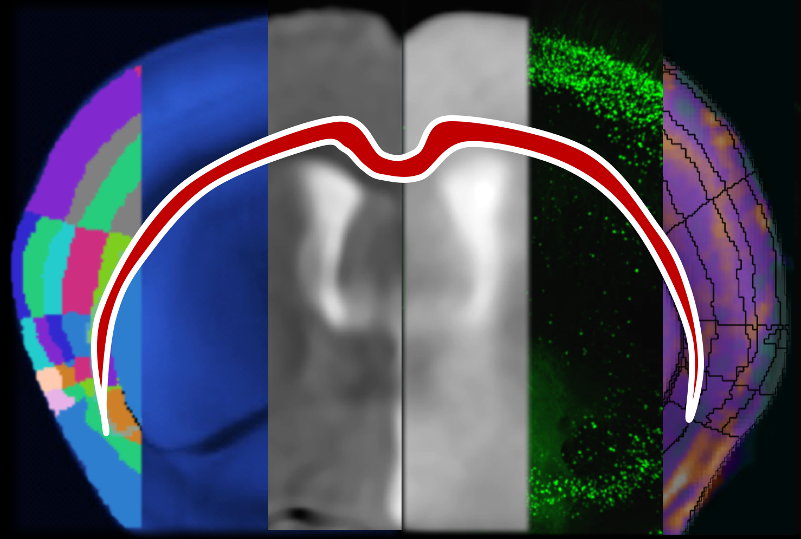

 

  

___

**MIRACL** (**M**ulti-modal **I**mage **R**egistration **A**nd **C**onnectivity ana**L**ysis) is a general-purpose, open-source pipeline for automated:

1. Registration of cleared and imaging data (ex. LSFM and MRI) to atlases (ex. Allen Reference Atlas)
2. 3D Segmentation and feature extraction of cleared data
3. Tract-specific or network-level connectivity analysis
4. Statistical analysis of cleared and imaging data
5. Comparison of dMRI/tractography, virus tracing, and connectivity atlases
6. Atlas generation and Label manipulation

___

**NEW WORKFLOW/FEATURE RELEASE **

We will be releasing our AI-based Cartography of Ensembles (ACE) workflow, an end-to-end, automated pipeline that integrates cutting-edge deep learning segmentation models and advanced statistical methods to enable unbiased and generalizable brain-wide mapping of 3D alterations in neuronal activity, morphology, or connectivity at the sub-regional and laminar levels beyond atlas-defined regions.

:program:`ACE` will be available as part of MIRACL in January 2024.

Copyright (c) 2023 Maged Goubran

All Rights Reserved

___

We provide containers for using the software (Docker and Singularity) as well as
local install instructions. For more details, see our [docs](https://miracl.readthedocs.io). 
Note that the base image for the docker container can be found in [docker](docker) and
the container `mgoubran/miracl` is built on top of that.
