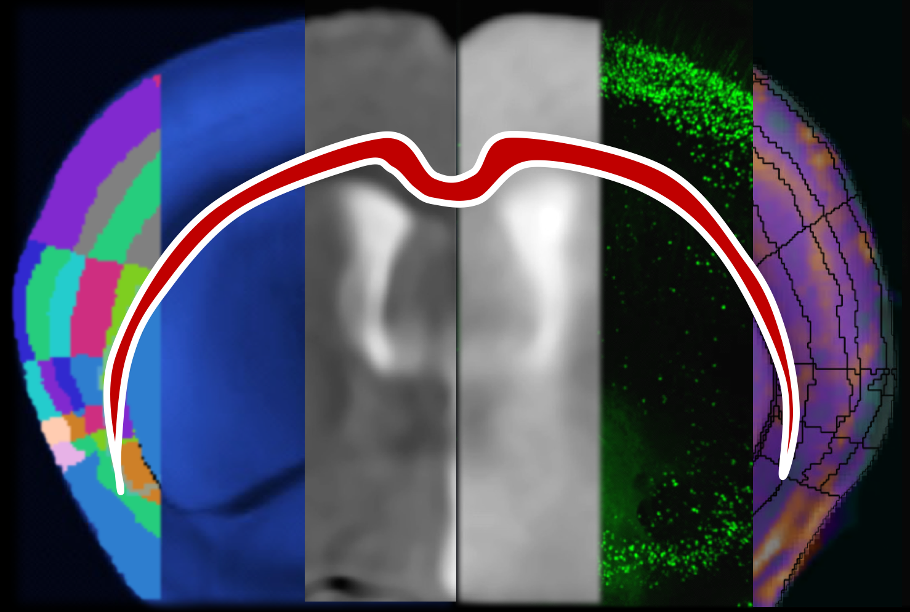

   

  

___

**MIRACL** (**M**ulti-modal **I**mage **R**egistration **A**nd **C**onnectivity ana**L**ysis) is a general-purpose, open-source pipeline for automated:

1. Registration of cleared and imaging data (ex. LSFM and MRI) to atlases (ex. Allen Reference Atlas)
2. 3D Segmentation and feature extraction of cleared data
3. Tract-specific or network-level connectivity analysis
4. Statistical analysis of cleared and imaging data
5. Comparison of dMRI/tractography, virus tracing, and connectivity atlases
6. Atlas generation and Label manipulation

___

\*\***NEW WORKFLOW/FEATURE ANNOUNCEMENT**\*\*

We will soon release our **M**apping **A**xonal **P**rojections in **L**ight-sheet Fluorescence Microscopy in **3**D (**MAPL3**) workflow as part of the **MIRACL** platform. **MAPL3** is an end-to-end deep learning pipeline for generalizable, brain-wide mapping of structural connectivity at the single-axon level using tera-voxel light sheet fluorescence microscopy (LSFM) dataset. It's built for scalability, precision, and biological insight and bridges the gap between raw LSFM data and interpretable brain-wide connectivity maps.

- **SPECTRE (Spatial Patch Encoding with Convolutional TransfoRmEr) Network**: A novel deep learning design that fuses convolutional precision with transformer-level context awareness, capturing both fine axonal details and global anatomical structure.
- **Self-Supervised Generative Pretraining**: Pretrained on ~22,000 3D sub-volumes using advanced self-supervised learning and unique patch-based augmentation strategies. Enhances model robustness across diverse imaging conditions and experimental setups.
- **State-of-the-Art Performance**: Extensively benchmarked against leading DL pipelines, **MAPL3** consistently outperforms them in both in- and out-of-distribution datasets, from patch-level inference to full-brain reconstructions.
- **Neuroscientific Discovery at Scale**: **MAPL3** reveals cell-type-specific axonal connectivity patterns previously unresolved by existing methods, enabling new insights into mesoscale and quantitative brain circuitry analysis.

---

\*\***NEW WORKFLOW/FEATURE RELEASE**\*\*

We have released our AI-based Cartography of Ensembles (ACE) workflow, an end-to-end, automated pipeline that integrates cutting-edge deep learning segmentation models and advanced statistical methods to enable unbiased and generalizable brain-wide mapping of 3D alterations in neuronal activity, morphology, or connectivity at the sub-regional and laminar levels beyond atlas-defined regions.

ACE is now available. Tutorials and usage examples for ACE can be found in our [docs](https://miracl.readthedocs.io/en/latest/tutorials/workflows/ace_flow/ace_flow.html). As of MIRACL version `2.4.2` the pre-trained DL models are publicly available and will automatically be downloaded during installation.

___

We recommend using MIRACL with the Docker or Apptainer containers we provide. Legacy instructions for installing MIRACL locally are available but we recommend against it. For more details, see our 
[docs](https://miracl.readthedocs.io).

___

Attention: We changed the license for **MIRACL** from `GPL-3.0` to `CC BY-NC-ND 4.0` as of version `2.5.0`. For more information read our [LICENSE.md](LICENSE.md) or go directly to the [Creative Commons](https://creativecommons.org/licenses/by-nc-nd/4.0/legalcode.en) website.

___
Copyright (c) 2025 Maged Goubran

All Rights Reserved
