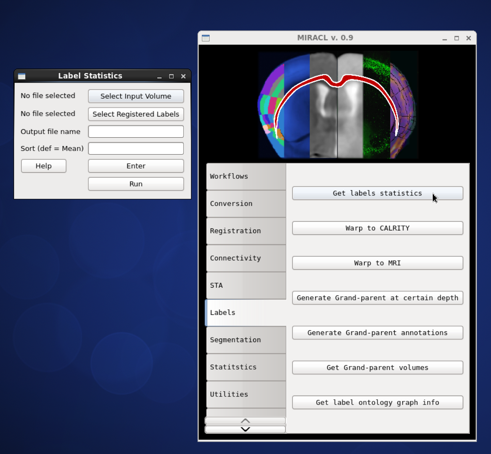
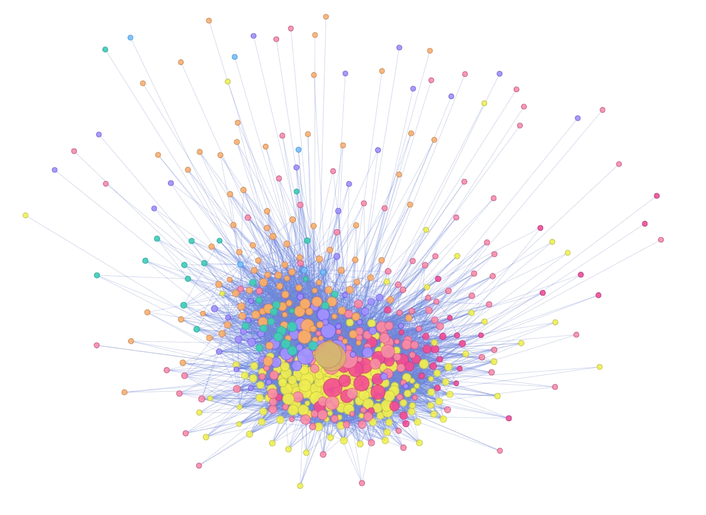
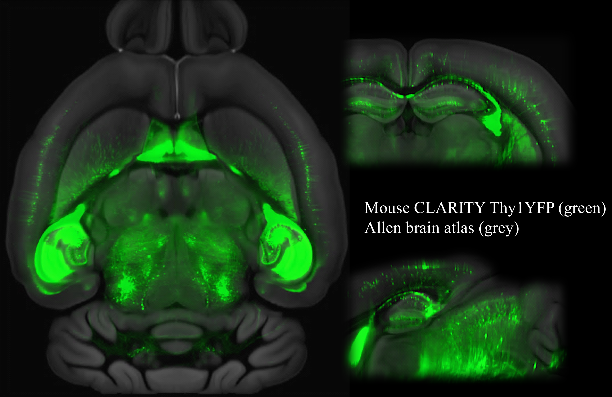
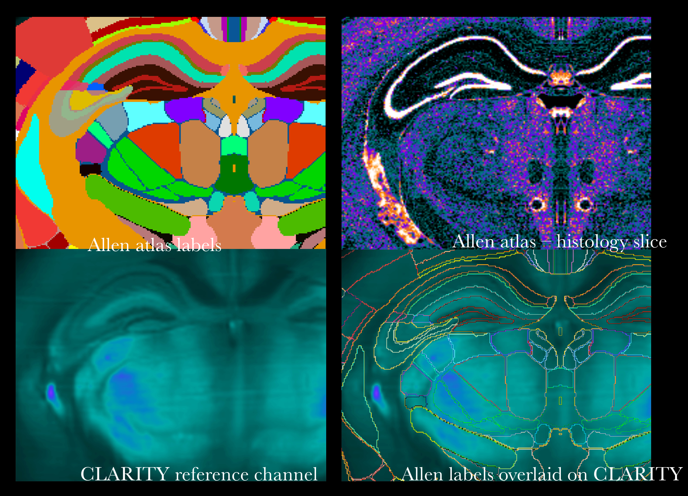
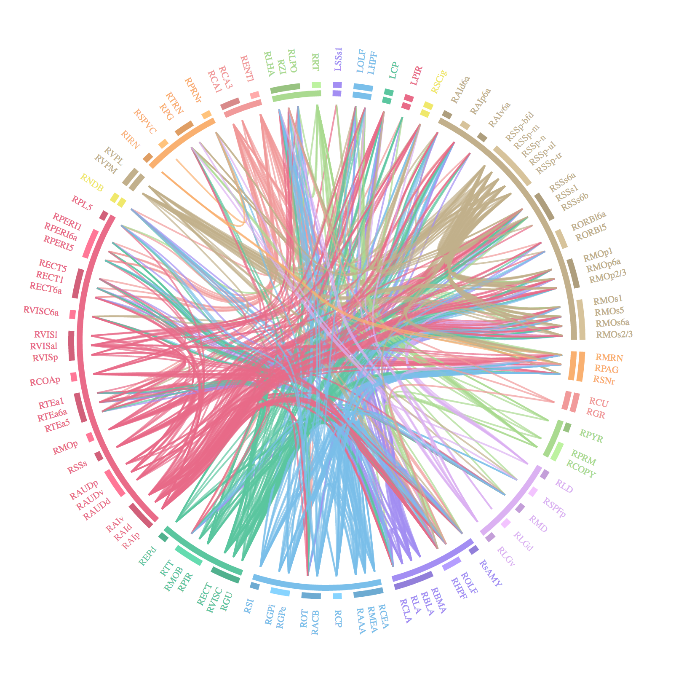
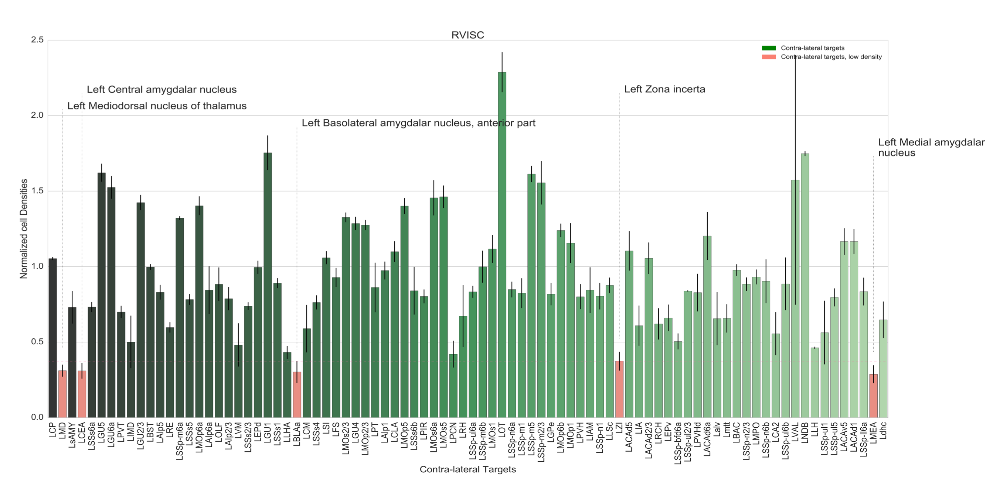
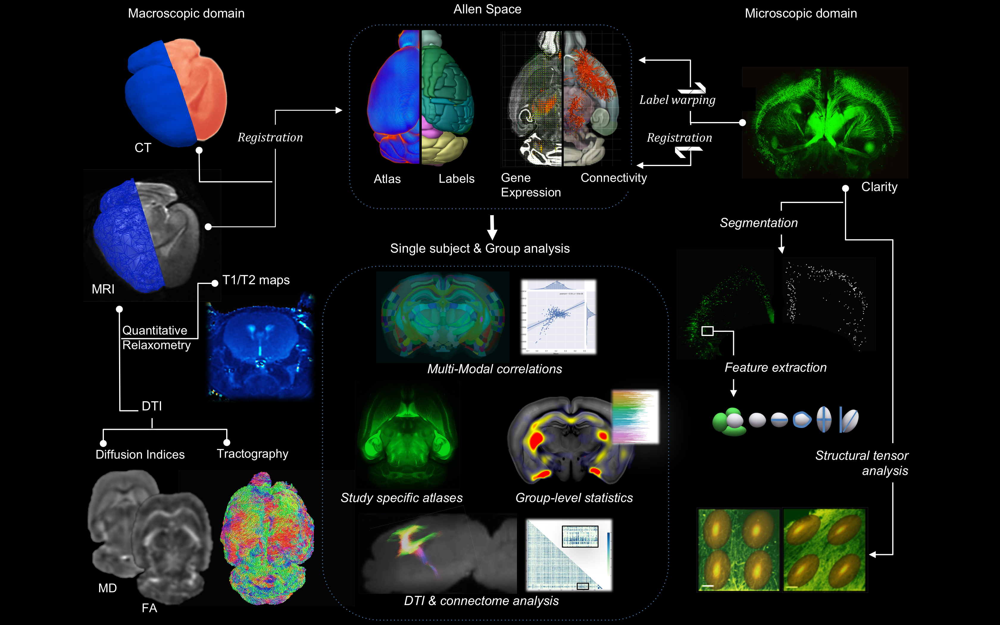
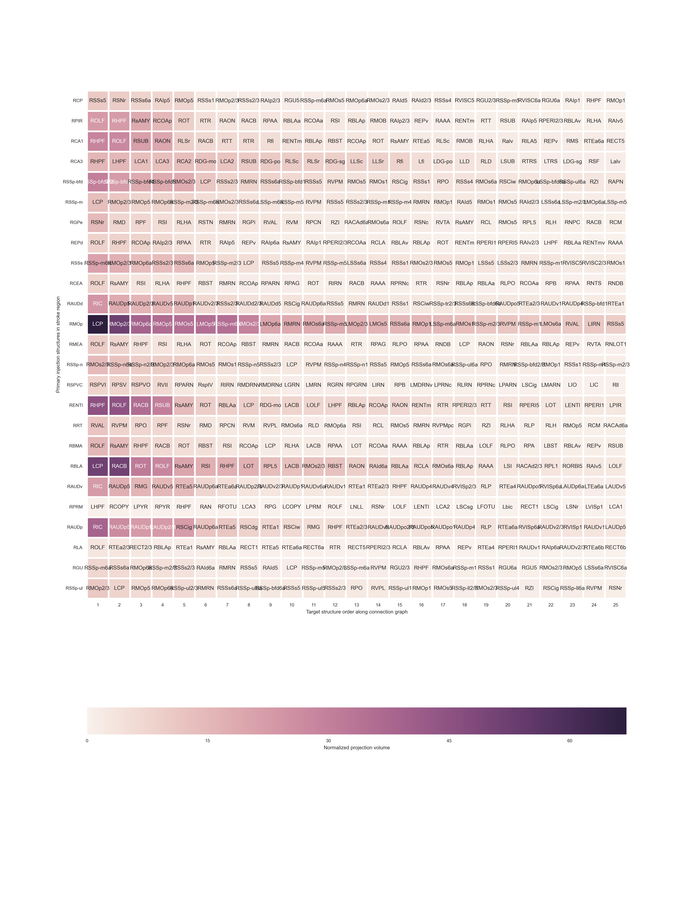
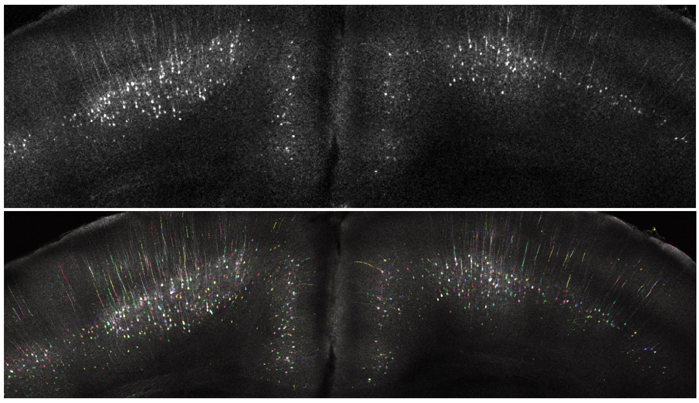

# Miracl Gallery

Here is some representative work!

## Graphical User Interface (GUI)

### Brain Graph

## Clarity Registration

## Connectivity

## Pipeline

## Registration and Segmentation

