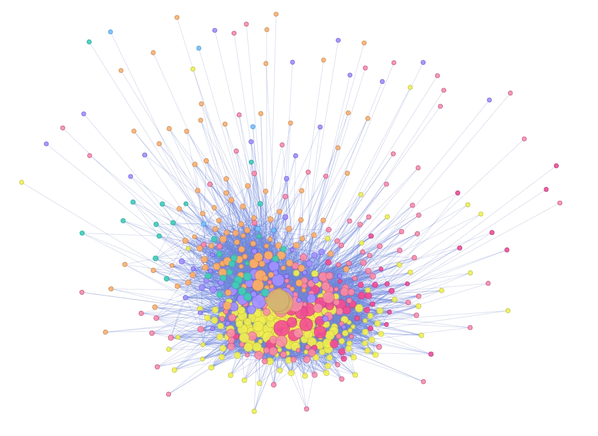
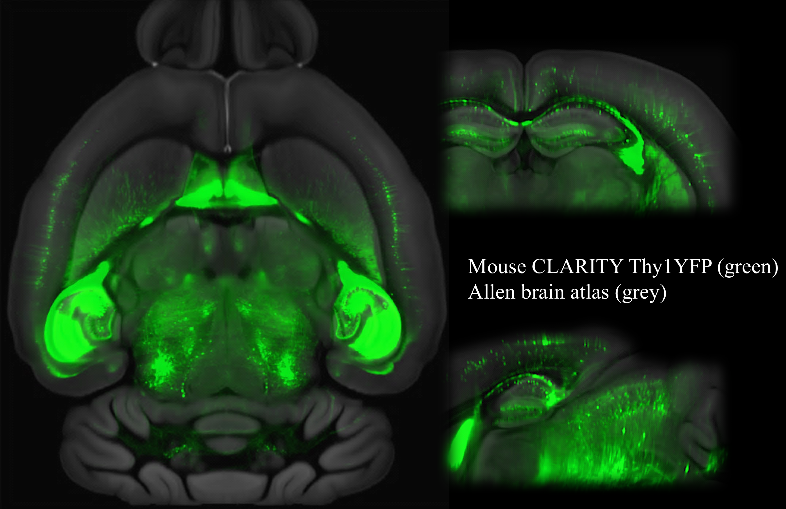
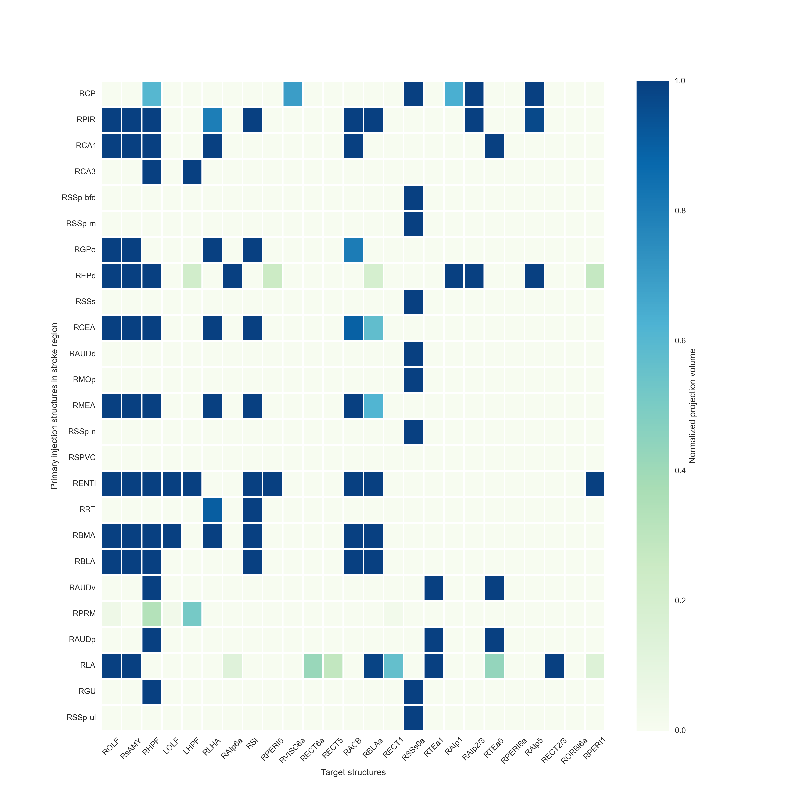
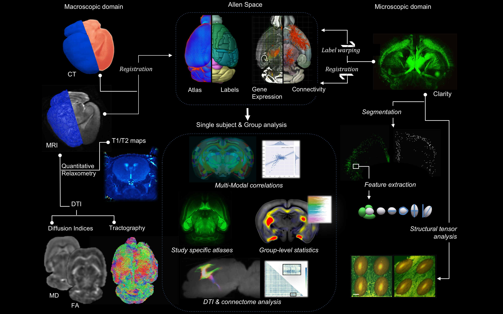
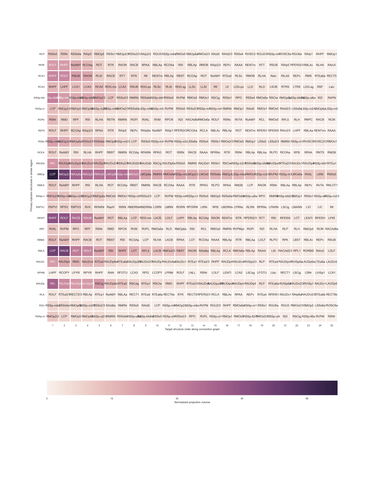
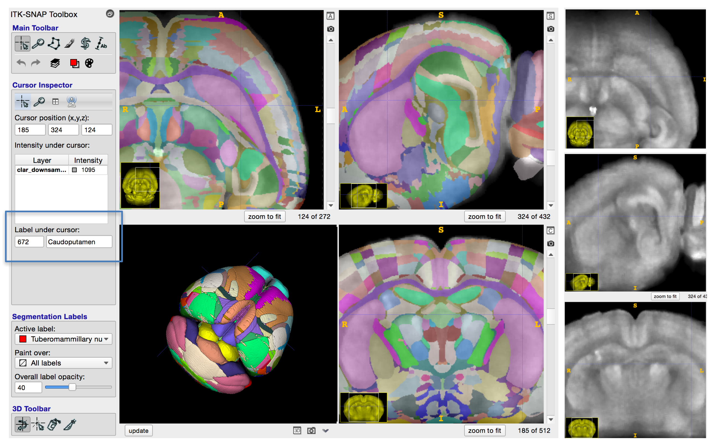
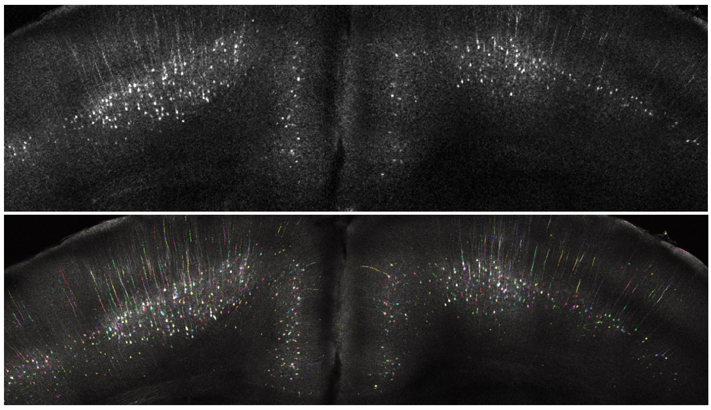

Gallery
#######

Here is some representative work!

Graphical User Interface (GUI)
==============================

.. image:: ../images/MIRACL_main-menu.png
   :alt: miracl_main-menu

Brain Graph
===========

Clarity Registration
====================

.. image:: ./images/clarity_registration_example2.png
   :alt: clarity_registration_example2

Connectivity
============

   
   Connectivity matrix heat map with 25 labels

.. figure:: ./images/connectogram_grouped_by_parent_id_50_labels.png
   :alt: connectogram_grouped_by_parent_id_50_labels

   Connectogram grouped by parent ID with 50 labels

.. figure:: ./images/density_along_connectivity_graph.png
   :alt: density_along_connectivity_graph

   Density along connectivity graph

Pipeline
========

Registration and Segmentation
=============================

   Projection map along graph with 25 labels

   Registration result visualized in ITK-SNAP

   Segmentation
