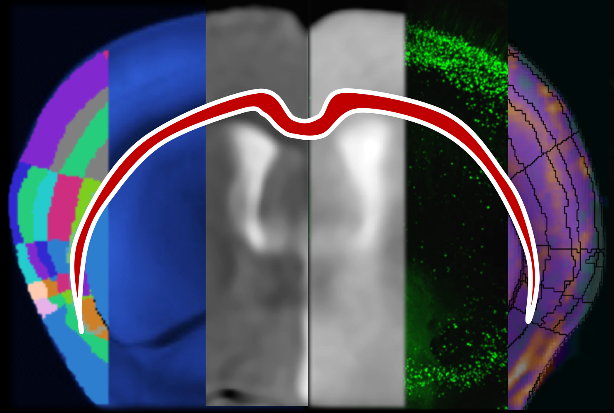

.. MIRACL documentation master file, created by
   sphinx-quickstart on Fri Dec 14 15:34:18 2018.
   You can adapt this file completely to your liking, but it should at least
   contain the root `toctree` directive.

Welcome to MIRACL's documentation!
==================================
.. image:: https://img.shields.io/github/license/mgoubran/MIRACL
    :alt: Github license
.. image:: https://img.shields.io/docker/pulls/mgoubran/miracl?label=Docker%2FRelease%20Downloads
    :alt: Docker Pulls

MIRACL (Multi-modal Image Registration And Connectivity anaLysis) is a general-purpose, open-source pipeline for automated:

1) Registration of mice clarity data to the Allen reference atlas
2) Segmentation & feature extraction of mice clarity data in 3D (Sparse & nuclear staining)
3) Registration of mice multimodal imaging data (MRI & CT, in-vivo & ex-vivo) to Allen reference atlas
4) Tract or label specific connectivity analysis based on the Allen connectivity atlas
5) Comparison of diffusion tensort imaging (DTI)/tractography, virus tracing using CLARITY & Allen connectivity atlas
6) Statistical analysis of CLARITY & Imaging data
7) Atlas generation & Label manipulation

Copyright © 2022 Maged Goubran @ AICONSlab (maged.goubran@utoronto.ca)

All Rights Reserved.

---

We provide containers for using the software (`Docker <./installation.md>`_) and 
`Singularity <./installation.md>`_) as well as `local install instructions <./installation.md>`_.

.. toctree::
   :maxdepth: 3
   :caption: Contents:
   :hidden:

   about
   Installation <installation>
   user-guide
   tutorials
   troubleshooting
   data
   gallery
