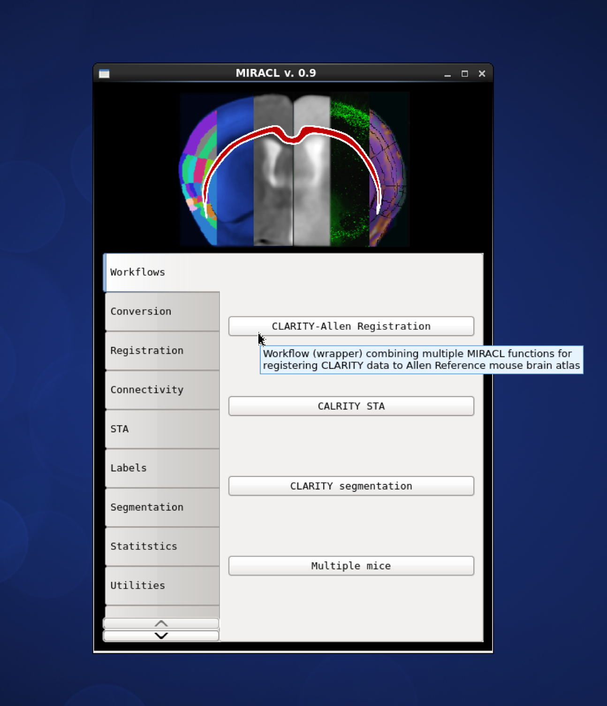

# Getting started

## command line

activate miracl

    $ source activate miracl

to look at available modules, check the help

    $ miracl -h

you should get this in the terminal:

    usage: miracl [-h] {connect,conv,flow,lbls,reg,seg,sta,utils} ...
    
    positional arguments:
      {connect,conv,flow,lbls,reg,seg,sta,utils}
        connect             connect functions
        conv                conv functions
        flow                workflows to run
        lbls                Label manipulation functions
        reg                 registration functions
        seg                 segmentation functions
        sta                 STA functions
        sta                 STA functions
        utils               Utils functions
    
    optional arguments:
      -h, --help            show this help message and exit

let’s say you want the workflows *conv* module, check its help

    $ miracl flow -h
    
you should get:

    usage: miracl conv [-h] {tiff_nii,nii_tiff,set_orient,gui_opts} ...
    
    positional arguments:
      {tiff_nii,nii_tiff,set_orient,gui_opts}
        tiff_nii            convert Tiff stacks to Nii
        nii_tiff            convert Nii volume to Tiff stack
        set_orient          Set orientation tag with GUI
        gui_opts            GUI options
    
    optional arguments:
      -h, --help            show this help message and exit

for the help of a specific function in the *conv* module, say *tiff_nii*, type:

    $ miracl conv tiff_nii -h

you should get:

    usage:  Converts Tiff images to Nifti 

    A GUI will open to choose your:

        - < Input CLARITY TIFF dir >

    ----------

    For command-line / scripting

    Usage: miracl_conv_convertTIFFtoNII.py -f [Tiff folder]

    Example: miracl_conv_convertTIFFtoNII.py -f my_tifs -o stroke2 -cn 1 -cp C00 -ch Thy1YFP -vx 2.5 -vz 5

    required arguments:
      -f dir, --folder dir  Input CLARITY TIFF folder/dir

    optional arguments:
      -d , --down           Down-sample ratio (default: 5)
      -cn , --channum       Chan # for extracting single channel from multiple channel data (default: 0)
      -cp , --chanprefix    Chan prefix (string before channel number in file name). ex: C00
      -ch , --channame      Output chan name (default: eyfp)
      -o , --outnii         Output nii name (script will append downsample ratio & channel info to given name)
      -vx , --resx          Original resolution in x-y plane in um (default: 5)
      -vz , --resz          Original thickness (z-axis resolution / spacing between slices) in um (default: 5)
      -c  [ ...], --center  [ ...]
                            Nii center (default: 0,0,0 ) corresponding to Allen atlas nii template
      -dz , --downzdim      Down-sample in z dimension, binary argument, (default: 1) => yes
      -pd , --prevdown      Previous down-sample ratio, if already downs-sampled
      -h, --help            Show this help message and exit

    miracl tiff_nii: error: argument -f/--folder is required
    
To run the function with an input dir called *input_tiff_dir*, a down-sampling factor of *5* and an output called *test*,
you would type:

    $ miracl conv tiff_nii -f input_tiff_dir -d 5 -o test

## GUI

To run the main GUI:

    $ miraclGUI
    
the gui should open:

To get the GUI of a specific function, run it without arguments, for example:

    $ miracl conv tiff_nii

** warning not all functions have GUIs yet.. working on it!*

#### Please check the rest of the tutorials for more detailed documentation