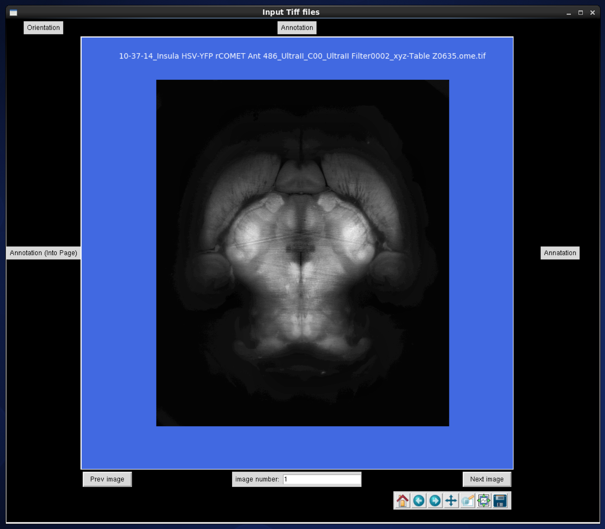
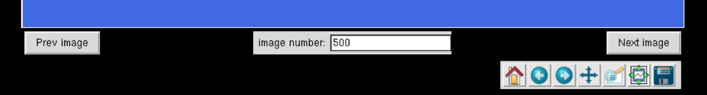
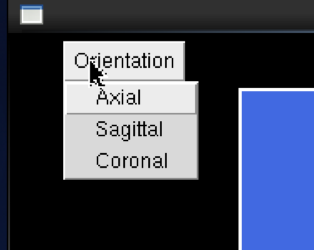
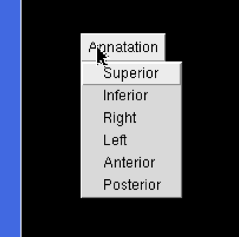
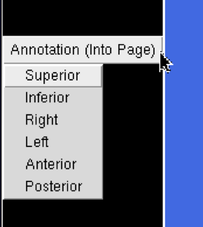
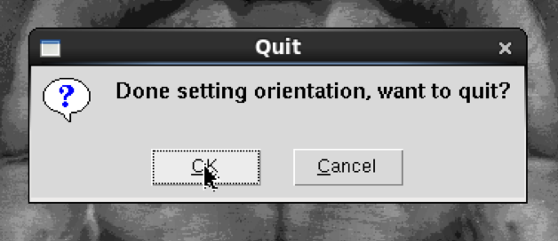
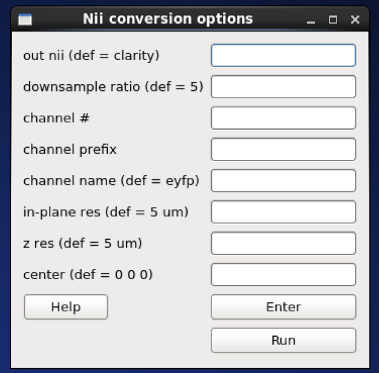

CLARITY whole-brain registration to Allen atlas

The registration workflow relies on an autofluorescence channel input 
(tiff files), and can perform whole-brain or hemisphere registrations to 
the Allen atlas.

This workflow performs the following tasks:

1) Sets orientation of input data using a GUI
2) Converts TIFF to NII
3) Registers CLARITY data (down-sampled images) to Allen Reference mouse brain atlas
4) Warps Allen annotations to the original high-res CLARITY space
5) Warps the higher-resolution CLARITY to Allen space (if chosen)

# Test data
A test dataset (CLARITY autofluorescence channel) for registration is found 
here under `data`: https://www.dropbox.com/sh/i9swdedx7bsz1s8/AABpDmmN1uqPz6qpBLYLtt8va

# GUI

Run:

```
$ miraclGUI
```

and and choose `CLARITY-Allen Registration` from the `Workflows` tab:


Or run:

```
$ miracl flow reg_clar
```

---

First choose the input tiff folder with the auto fluorescence channel:


The following GUI will appear which opens the data and lets you set its
orientation manually:



You can navigate through the data using the bar bellow, by specifying the slice number
or using the arrows:



First choose the data plane (axial, coronal or sagittal):



Then choose the orientation at the top and right of the image:



Then choose the orientation for scrolling through the slices (going into 
the page), can confirm the orientation by changing the image number at the 
bottom (enter higher number and press Enter), or using the Next or Prev image 
buttons:



Finally close the GUI:



Next, set the tiff conversion parameters:



Conversion parameters description:

- **out nii**: Output nifti name

- Down-sample ratio (default: `5`)

- **Channel #**: number for extracting single channel from multiple channel data (default: 1) [leave blank if single channel data/tiff files]

- **Chan prefix**: string before channel number in file name [leave blank if single channel]
    - for example if tiff file name has `_C001_.tif` for channel 1 and 
    `_C002_.tif` for channel 2, to choose channel 1 if it's the auto 
    fluorescence channel:
        - Chan number would be: 1
        - Chan prefix would be: C00

- **Channel name**: output channel name (default: `eyfp`)

- **In-plane res**: original resolution in x-y plane in um (default: `5`)

- **z res**: thickness (z-axis resolution / spacing between slices) in um (default: `5`)

- **Center**: center of nifti file

Next, choose the registration options:


Registration parameters description:

- **Hemi**: warp allen labels with hemisphere split (Left different than Right 
labels) or combined (L & R same labels / Mirrored) accepted inputs are: 
<split> or <combined>  (default: `combined`)

- **Labels resolution:** voxel size/Resolution of labels in um accepted inputs 
are: 10, 25 or 50  (default: `10`)

- **Olfactory bulb:** if bulb is included in the dataset accepted inputs are: 
0 -> not included; 1 -> included (default: `0`)

- **Side**: (only if registering hemisphere, else leave blank) accepted inputs are: 
`rh` (right hemisphere) or `lh` (left)

# Command-line

```
Usage:

    $ miracl flow reg_clar -f [Tiff folder]

Example:

    $ miracl flow reg_clar  -f my_tifs -n "-d 5 -ch autofluo" -r "-o ARS -m combined -v 25"

arguments (required):

    f. Input Clarity tif dir/folder

optional arguments (remember the quotes):

    conversion to nii (invoked by -n " "):

    d.  [ Downsample ratio (default: 5) ]
    cn. [ chan # for extracting single channel from multiple channel data (default: 1) ]
    cp. [ chan prefix (string before channel number in file name). ex: C00 ]
    ch. [ output chan name (default: eyfp) ]
    vx. [ original resolution in x-y plane in um (default: 5) ]
    vz. [ original thickness (z-axis resolution / spacing between slices) in um (default: 5) ]
    c.  [ nii center (default: 5.7 -6.6 -4) corresponding to Allen atlas nii template ]

    Registration (invoked by -r " "):

    o. Orient code (default: ALS)
    to orient nifti from original orientation to "standard/Allen" orientation

    m. Warp allen labels with hemisphere split (Left different than Right labels) or combined (L & R same labels / Mirrored)
    accepted inputs are: <split> or <combined>  (default: combined)

    v. Labels voxel size/Resolution of labels in um
        accepted inputs are: 10, 25 or 50  (default: 10)

    l. image of input Allen Labels to warp (default: annotation_hemi_split_10um.nii.gz - which are at a resolution of 0.01mm/10um)
        input could be at a different depth than default labels

        If l. is specified (m & v cannot be specified)


# Main Outputs

reg_final/clar_allen_space.nii.gz: Clarity data in Allen reference space

reg_final/clar_downsample_res(vox)um.nii.gz : Clarity data downsampled and oriented to "standard"

reg_final/annotation_hemi_(hemi)_(vox)um_clar_downsample.nii.gz : Allen labels registered to downsampled Clarity

reg_final/annotation_hemi_(hemi)_(vox)um_clar_vox.tif : Allen labels registered to oriented Clarity

reg_final/annotation_hemi_(hemi)_(vox)um_clar.tif: Allen labels registered to original (full-resolution) Clarity


# To visualize results

run

    $ miracl reg check

Usage:

    $ miracl reg check -f [reg final folder] -v [visualization software] -s [reg space (clarity or
    allen)]

Example:

    $ miracl reg check -f reg_final -v itk -s clarity

Arguments (required):

    -f Input final registration folder

Optional arguments:

    -v Visualization software: itkSNAP 'itk' (default) or freeview 'free'
    -s Registration Space of results: clarity (default) or allen
```
