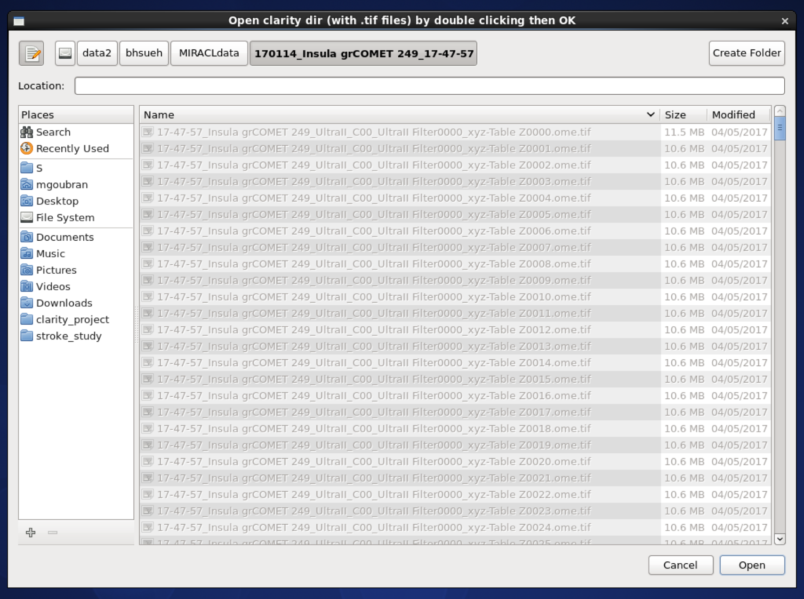
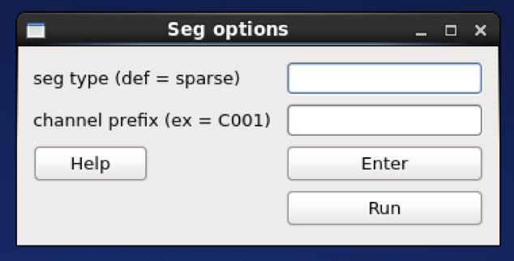
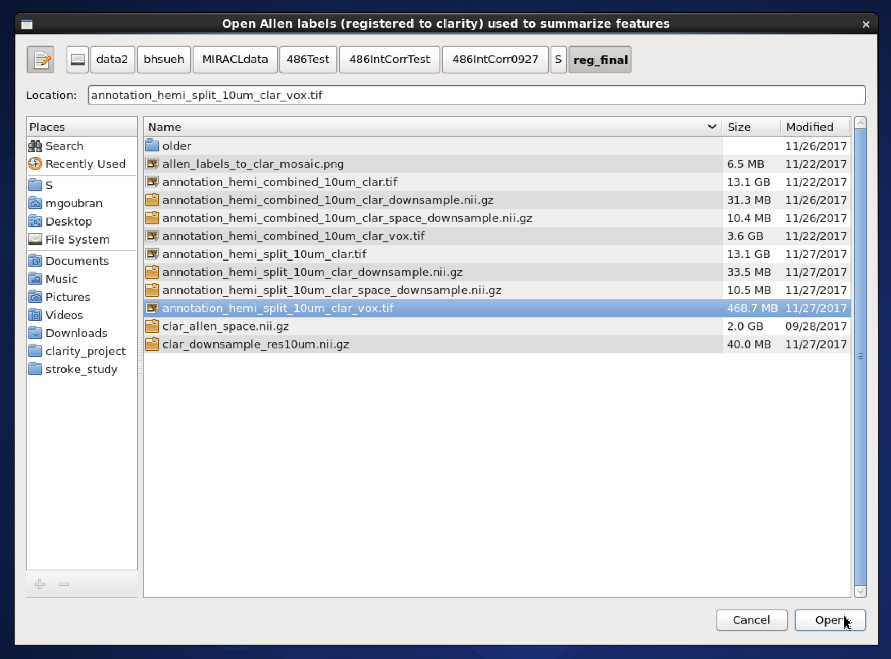

# CLARITY whole-brain segmentation

There are multiple segmentation functions for different data (stains/channels):

- `virus`
- `cFos`
- `sparse`
- `nuclear`

The segmentation workflow relies on an output from the registration workflow,
but the segmentation wrapper function can be run without running the 
registration workflow.

This workflow performs the following tasks:

1) Segments neurons in cleared mouse brain of sparse or nuclear stains in 3D
2) Voxelizes segmentation results into density maps with Allen atlas resolution
3) Computes features of segmented image and summarizes them per label

It executes:

```
seg/miracl_seg_clarity_neurons_wrapper.sh
seg/miracl_seg_voxelize_parallel.py
seg/miracl_seg_feat_extract.py
```

## GUI

Select from the main GUI menu (invoked from the cli: `$ miraclGUI`) or run:

```
$ miracl flow seg
```

The following window will appear to choose the input tiff folder with 
`Thy1-YFP` or other channel:



Next choose the segmentation parameters:



| Parameter | Description | Default |
| ---       | ---         | ---     |
| seg type | Channel type: <ul><li>`virus`</li><li>`cFos`</li><li>`sparse` (like `Thy1 YFP`)</li><li>`nuclear` (like `PI`)</li></ul> | `sparse` |
| channel prefix | Channel prefix and number if multiple channels. Example: `Filter0001`) | `None` |

Then choose the registered labels `annotation_hemi_{side}_**um_clar_vox.tif` to summarize segmentation features where:

- `{side}` -> `combined` or `split`
- `**` is the resolution -> `10`, `25` or `50`



## Command-line

Usage:

```
$ miracl flow seg -f [ Tiff_folder ]
```

Example:

```
$ miracl flow seg -f my_tifs -t nuclear -s "-p C001" -e "-l reg_final/annotation_hemi_combined_25um_clar_vox.tif"
```

Arguments:

```
arguments (required):

    f. Input Clarity tif folder/dir [folder name without spaces]
    t. Channel type: sparse (like Thy1 YFP) or nuclear (like PI)

optional arguments (don't forget the quotes):

    Segmentation (invoked by -s " "):
        p. Channel prefix & number if multiple channels (like Filter0001)

    Feature extraction (invoked by -e " "):
        l. Allen labels (registered to clarity) used to summarize features
        reg_final/annotation_hemi_{hemi}_{vox}um_clar_vox.tif
```

## Main outputs

| File | Description |
| ---  | ---         |
| `segmentation/seg.{tif,mhd}`<br>or<br>`seg_nuclear.{tif,mhd}` | Segmentation image with all labels (cells) |
| `segmentation/seg_bin.{tif,mhd}`<br>or<br>`seg_bin_nuclear.{tif,mhd}` | Binarized segmentation image |
| `voxelized_seg.{tif,nii}` | Segmentation results voxelized to ARA resolution |
| `voxelized_seg_bin.{tif,nii}` | Binarized version |
| `clarity_segmentation_features_ara_labels.csv` | segmentation features summarized per ARA labels |

> Results can be opened in Fiji for visualization.

---

[<- back to tutorials](../../tutorials.md)
