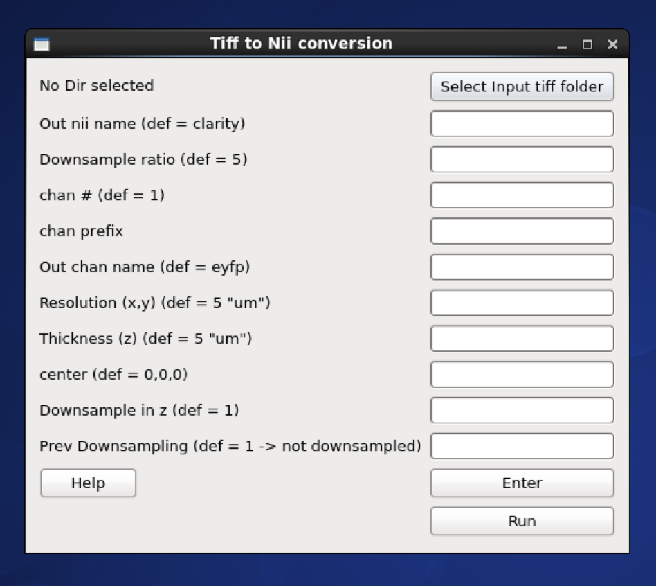
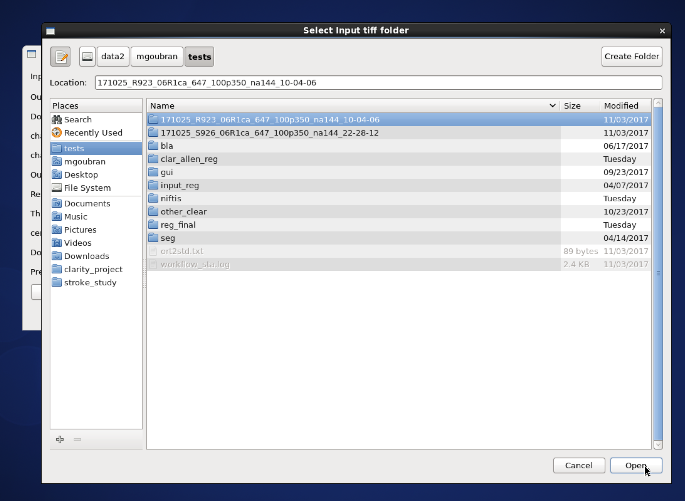

# Tiff to Nifti

To convert Tiff images to Nifti format for analysis or visualization.

## GUI

Run:

```
$ miracl conv tiff_nii
```

The following window will open:



From it, choose the input tiff folder:



Next choose the desired parameters or use the default by leaving the fields blank:

| Parameters | Description | Default |
| ---        | ---         | ---     |
| Out nii name | Output file name. | `clarity` |
| Downsample ratio | Downsample factor for nifti images. | `5` |
| chan # and prefix | Use if tiff files have more than one channel. For example, given the names `10-04-06_R923_06R1ca_647_100p350_na144_UltraII_**C001**_xyz-Table Z1284.ome.tif` for channel 1 and `10-04-06_R923_06R1ca_647_100p350_na144_UltraII_**C002**_xyz-Table Z1284.ome.tif` for channel 2 with the latter being the desired channel for conversion, `chan #` would be `2` and `chan prefix` would be `C00`. | Not invoked if not provided |
| Out chan name | Output channel name. | `eyfp` |
| Resolution (x,y) | Original resolution in x-y plane in um. | `5` |
| Thickness | Original thickness (z-axis resolution/spacing between slices) in um. | `5` |
| center | Center of Nifti file. | `0 0 0` |
| Downsample in z | Down-sample in z dimension. Binary:<ul><li>`0` -> no</li><li>`1` -> yes</li></ul> | `1` |
| Prev Downsampling | Previous downsample ratio if already downsampled. Accepted inputs are:<ul><li>`0` -> downsampled</li><li>`1` -> not downsampled</li></ul> | `1` |

After choosing the parameters press `Enter` to save them then `Run` to start 
conversion process.

> After the conversion is done, nifti (`nii/nii.gz`) files can be visualized 
using the `ITKsnap` software

---

## Command-line

Usage:

```
$ miracl conv tiff_nii -f [ Tiff_folder ]
```

Example:

```
miracl conv tiff_nii -f my_tifs -o stroke2 -cn 1 -cp C00 -ch Thy1YFP -vx 2.5 -vz 5
```

Required arguments:

```
-f dir, --folder dir  Input CLARITY TIFF folder/dir
```

Optional arguments:

```
-d, --down           Down-sample ratio (default: 5)
-cn, --channum       Chan # for extracting single channel from multiple channel data (default: 1)
-cp, --chanprefix    Chan prefix (string before channel number in file name). ex: C00
-ch, --channame      Output chan name (default: eyfp)
-o, --outnii         Output nii name (script will append downsample ratio & channel info to given name)
-vx, --resx          Original resolution in x-y plane in um (default: 5)
-vz, --resz          Original thickness (z-axis resolution / spacing between slices) in um (default: 5)
-c [ ...], --center  [ ...]
                      Nii center (default: 0,0,0 ) corresponding to Allen atlas nii template
-dz, --downzdim      Down-sample in z dimension, binary argument, (default: 1) => yes
-pd, --prevdown      Previous down-sample ratio, if already down-sampled
-h, --help            Show this help message and exit
```

---

[<- back to tutorials](../../../tutorials.md)
