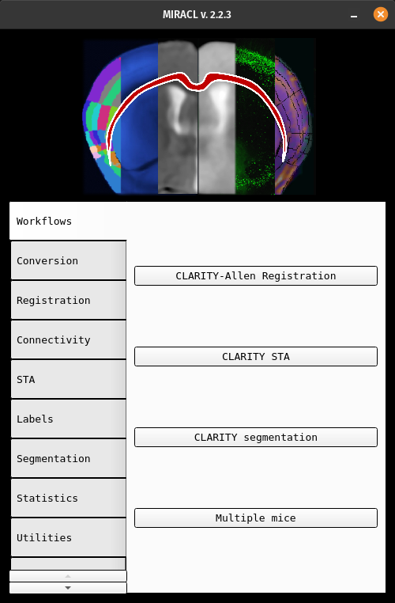
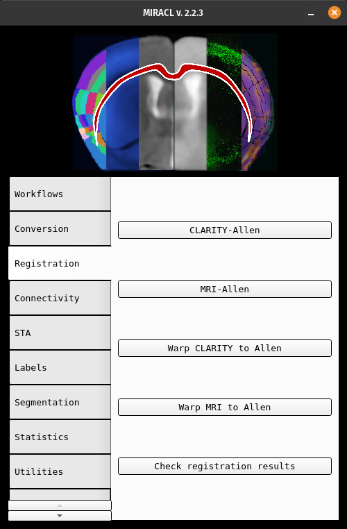
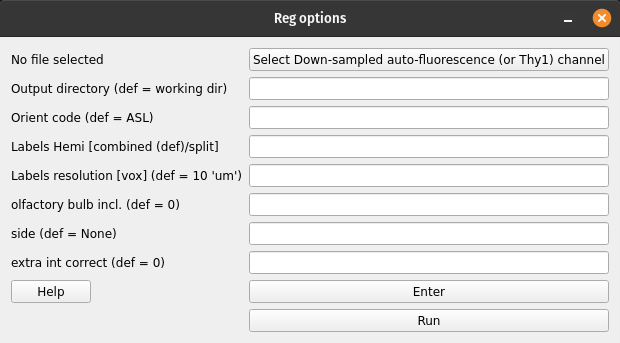

CLARITY-Allen registration
##########################

This function will do the following:

#. Registers CLARITY data (down-sampled images) to Allen Reference mouse brain 
   atlas
#. Warps Allen annotations to the original high-res CLARITY space
#. Warps the higher-resolution CLARITY to Allen space

GUI
===

To open the main registration menu, open MIRACL's main menu first by running:

.. code-block::

   $ miraclGUI

MIRACL's main menu will open:

Select the ``Registration`` tab on the left for the main registration menu.

The main registration window will look like this:

From here you can select ``CLARITY-Allen`` to start the registration. The
``Reg options`` menu will open:

.. tip::
   To open the above Reg options menu directly, run: ``$ miracl reg clar_allen``

The registration will be run on downsampled CLARITY Nii images. You can 
provide the folder containing these files in the first field. **This parameter 
is required to run the registration**. You can use :program:`MIRACL's` 
conversion methods to create the downsampled files if you do not have them yet.

.. table::

   ====  ==============================  ========================================================================================================================================================  =======
   Flag  Parameter                       Description                                                                                                                                               Default
   ====  ==============================  ========================================================================================================================================================  =======
   \-i   Input down-sampled CLARITY Nii  Preferably auto-fluorescence channel data (or Thy1_EYFP if no auto chan). File name should have ``**x_down`` like ``05x_down`` (meaning 5x downsampled).  Required. Script exits with error 1 if not provided. 
   
                                         Example:
   
                                         * ``combined``
                                         * ``split``
   ====  ==============================  ========================================================================================================================================================  =======

All remaining parameters are optional. If left blank, their respective default 
values will be used:

.. table::

   ====  =======================  =================================================================================================================================================================================================  =================================
   Flag  Parameter 	              Description 	                                                                                                                                                                                     Default
   ====  =======================  =================================================================================================================================================================================================  =================================
   \-r 	 Output directory         Directory the output (results) will be written to. 	                                                                                                                                               :file:`<working_directory>/reg_final`
   \-o 	 Orient code 	            Code to orient nifti from original orientation to 'standard/Allen' orientation. 	                                                                                                                 ``ALS``
   \-m   Labels hemi              Chose to register to one or both hemispheres. Warps Allen labels with hemisphere split (L differ from R labels) or combined (L and R have the same labels i.e. are mirroed). Accepted inputs are:  ``combined``
   
                                  * ``combined``
                                  * ``split``
   \-v   Labels resolution [vox]  Labels voxel size/resolution in um. Accepted inputs are:                                                                                                                                           ``10``
   
                                  * ``10``
                                  * ``25``
                                  * ``50``
   \-b   Olfactory bulb included  Specify whether the olfactory bulb is included in brain. Accepted inputs are:                                                                                                                      ``0``
   
                                  * ``0`` (not included)
                                  * ``1`` (included)
   \-s   Side                     Provide this parameter if you are only registering one hemisphere instead of the whole brain. Accepted inputs are:                                                                                 ``None``

                                  * ``rh`` (right hemisphere)
                                  * ``lh`` (left hemisphere)
   \-p   Extra int correct        If utilfn intensity correction has already been run, skip correction inside registration. Accepted inputs are:                                                                                     ``0``

                                  * ``0`` (don't skip)
                                  * ``1`` (skip)
   ====  =======================  =================================================================================================================================================================================================  =================================

After providing the parameters click ``Enter`` to save them and ``Run`` to 
start the registration process.

Once the registration is done the final files will be located in the output 
folder (default: :file:`<working_directory>/reg_final`). Files created in 
intermediate steps will be located in a folder called 
:file:`<working_directory>/clar_allen_reg`.

Command-line
============

The command-line version has additional functionality that is not included 
in the GUI version:

.. code-block::

   -l, input Allen labels to warp: input labels could be at a different depth than default labels.
       -m and -v flags cannot be used if this parameter is specified manually (default: annotation_hemi_combined_10um.nii.gz)
   -a, input custom Allen atlas: for example for registering sections
   -f, save mosaic figure (.png) of Allen labels registered to CLARITY (default: 1).
   -w, warp high-res clarity to Allen space (default: 0).
   -n, chan number for extracting single channel from multiple channel data (default: none)
   -x, chan prefix (string before channel number in file name). ex: C00 (default: none)

.. attention::
   Note that the above listed ``-i`` parameter (``input down-sampled CLARITY 
   Nii``) is also required for the command-line

Usage:

.. code-block::

   $ miracl reg clar_allen -i [ input_clarity_nii_folder ] -o [ orientation_code ] -m [ hemispheres ] -v [ labels_resolution ] -l [ input_labels ] -s [ side_if_hemisphere_only ] -b [ olfactory_buld_included ]

Example:

.. code-block::

   $ miracl reg clar_allen -i downsampled_niftis/SHIELD_03x_down_autoflor_chan.nii.gz -o ARI -m combined -b 1

.. |linktoworkshop| replace:: :doc:`here <../../../downloads/workshops/2024/stanford_20_03_2024/stanford_20_03_2024>`

.. include:: ../../../directives/tutorial_notebook_links.txt
