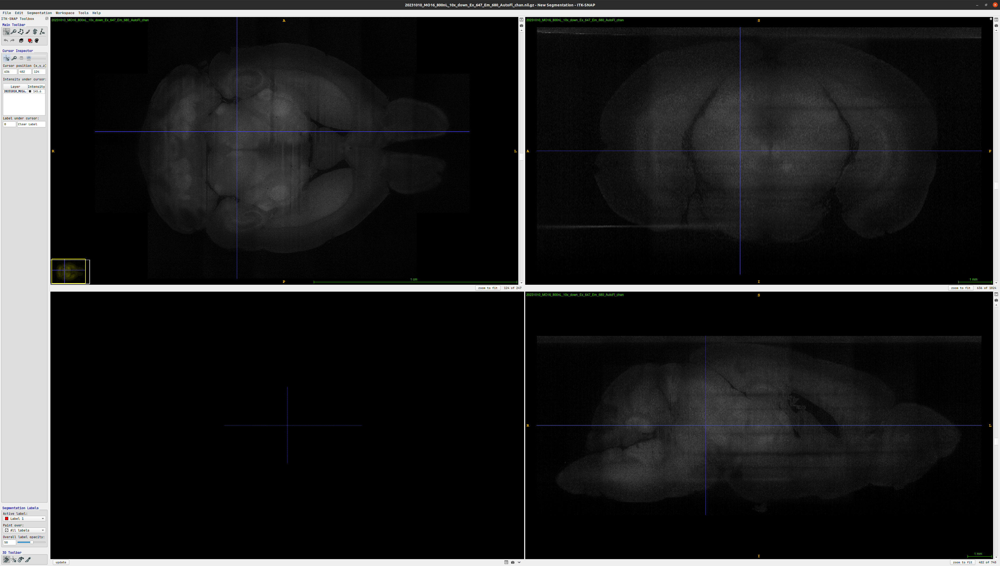
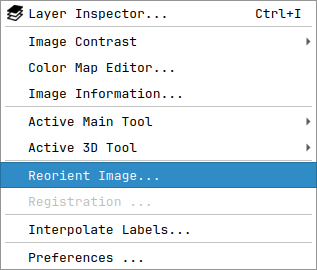
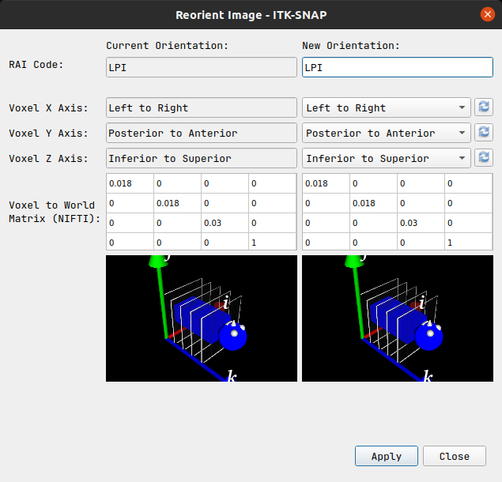
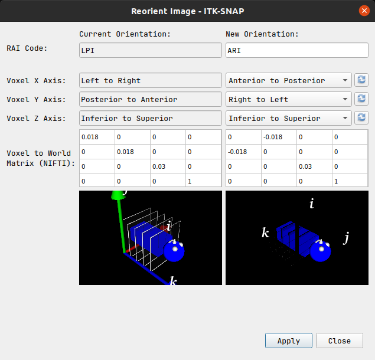
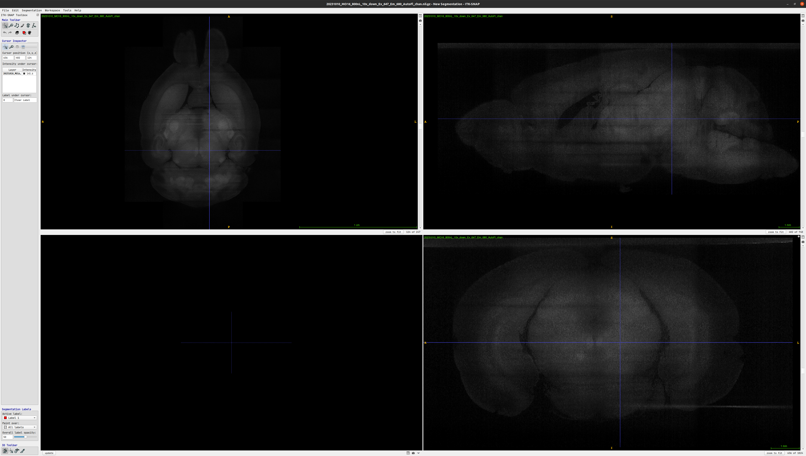
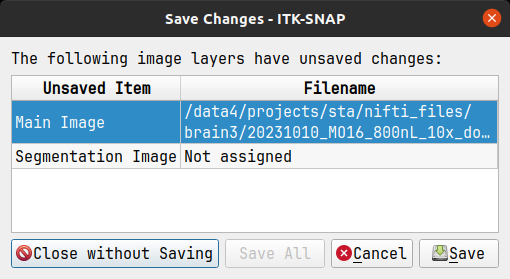

itk-SNAP re-orient image
========================

Chosing the correct image orientation is crucial for the registration to work.
:program:`itk-SNAP` let's you change your image orientation manually using their 
``Reorient Image`` tool. This tutorial will teach you how to use 
:program:`itk-SNAP` to manually re-orient an image from ``LPI`` to ``ARI``.

1. Load your image into :program:`itk-SNAP` like you would normally do.

2. Under ``Tools`` select ``Reorient Image...``

3. In the menu that will open, you will be presented with the current 
   orientation of your image on the left, and the new orientation on the right.

4. To change the orientation either enter the ``RAI`` orientation code directly
   in the ``RAI Code:`` text field, or change the ``x``, ``y`` and ``z`` axes
   of the image until the desired orientation is achieved. The preview window
   on the bottom right will give you an indication of where you are in 3D space.

5. Once the correct orientation has been confirmed and the changes are applied,
   the ``Reorient Image`` menu can be closed. Your image will now appear in the
   new orientation :program:`itk-SNAP`'s main window.

6. Save the newly oriented image manually or click ``Save`` when exiting
   :program:`itk-SNAP`. Click on ``Close without Saving`` if you don't want to 
   save the image in its new orientation.

