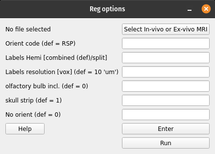

MRI whole-brain registration to Allen Atlas
###########################################

This registration method performs the following tasks:

#. Registers in-vivo or ex-vivo MRI data to Allen Reference mouse brain Atlas
#. Warps Allen annotations to the MRI space

GUI
===

Invoke with ``$ miraclGUI`` and select from main menu or run:

.. code-block::

   $ miracl reg mri_allen_nifty

The following window will open:

Click on ``Select In-vivo or Ex-vivo MRI`` and choose the input MRI nii 
(preferable T2-w) using the dialog window. Then set the registration options:

.. table::

   =======================  ==========================================================================================================================================================  ============
   Parameter	              Description	                                                                                                                                                Default
   =======================  ==========================================================================================================================================================  ============
   Orient code	            Orient nifti from original orientation to 'standard/Allen' orientation.	                                                                                    ``RSP``
   Labels Hemi	                                                                                                                                                                        ``combined``

                            Warp allen labels with hemisphere split (Left different than Right labels) or combined (Left and Right labels are the same/mirrored). Accepted inputs are:

                            * ``split``
                            * ``combined``
   Labels resolution [vox]	                                                                                                                                                            ``10``

                            Labels voxel size/resolution in um. Accepted inputs are:

                            * ``10``
                            * ``25``
                            * ``50``
   Olfactory bulb included	                                                                                                                                                            ``0``

                            Specify whether the olfactory bulb is included in brain. Accepted inputs are:

                            * ``0`` (not included)
                            * ``1`` (included)
   skull strip	                                                                                                                                                                        ``1``

                            Strip skull. Accepted inputs are:

                            * ``0`` (don't strip)
                            * ``1`` (strip)
   No orient	                                                                                                                                                                          ``0``

                            No orientation needed (input image in 'standard' orientation). Accepted inputs are:

                            * ``0`` (orient)
                            * ``1`` (don't orient)
   =======================  ==========================================================================================================================================================  ============

Click ``Enter`` and ``Run`` to start the registration process.

Command-line
============

Usage:

.. code-block::

   $ miracl reg mri_allen_nifty -i [ input invivo or exvivo MRI nii ] -o [ orient code ] -m [ hemi mirror ] -v [ labels vox ] -l [ input labels ] -b [ olfactory bulb ] -s [ skull strip ] -n [ no orient needed ]

Example:

.. code-block::

   $ miracl reg mri_allen_nifty -i inv_mri.nii.gz -o RSP -m combined -v 25

Arguments:

.. code-block::

   arguments (required):

     i.  input MRI nii
        Preferably T2-weighted

   optional arguments:
   
     o.  orient code (default: RSP)
         to orient nifti from original orientation to "standard/Allen" orientation
     m.  hemisphere mirror (default: combined)
         warp allen labels with hemisphere split (Left different than Right labels) or combined (L & R same labels / Mirrored)
         accepted inputs are: <split> or <combined>
     v.  labels voxel size/Resolution in um (default: 10)
         accepted inputs are: 10, 25 or 50
     l.  input Allen labels to warp (default: annotation_hemi_combined_10um.nii.gz )
         input labels could be at a different depth than default labels
         If l. is specified (m & v cannot be specified)
     b.  olfactory bulb included in brain, binary option (default: 0 -> not included)
     s.  skull strip or not, binary option (default: 1 -> skull-strip)
     f.  FSL skull striping fractional intensity (default: 0.3), smaller values give larger brain outlines
     n.  No orientation needed (input image in "standard" orientation), binary option (default: 0 -> orient)
