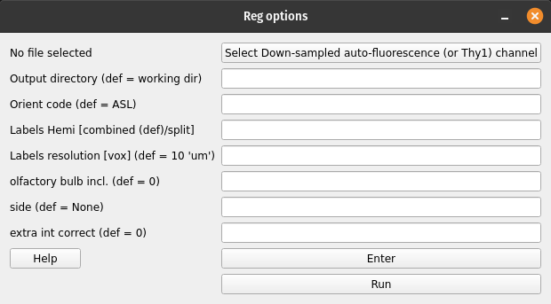

# CLARITY-Allen registration

1. Registers CLARITY data (down-sampled images) to Allen Reference mouse brain atlas
2. Warps Allen annotations to the original high-res CLARITY space
3. Warps the higher-resolution CLARITY to Allen space

## GUI

To open the main registration menu, open MIRACL's main menu first by running:

```
$ miraclGUI
```

MIRACL's main menu will open:


Select the Registration tab on the left for the main registration menu.

To open the main registration menu directly, run:

```
$ miracl reg clar_allen
```

The main registration window will look like this:


From here you can select `CLARITY-Allen` from the `Registration` tab on the
left to start the registration. The `CLARITY-Allen` menu will open:



The registration will be run on down-sampled CLARITY Nii images: You can 
provide the folder containing these files in the first field. **This
parameter is required to run the registration.** If you do not yet have the 
down-sampled files you can use MIRACL's conversion methods to create them.

All remaining parameters are optional. If left blank, their respective default
values will be used:

| Flag | Parameter | Description | Default |
| ---  | ---       | ---         | ---     |
| `-i` | Input down-sampled CLARITY Nii | Preferably auto-fluorescence channel data (or Thy1_EYFP if no auto chan). File name should have `**x_down` like `05x_down` (meaning 5x downsampled) -> ex.: <ul><li>`stroke13_05x_down_Ref_chan.nii.gz` (this should be accurate as it is used for Allen label upsampling to clarity)</li></ul> | |
| `-r` | Output directory | Directory the output (results) will be written to | `<working_directory>/reg_final` |
| `-o` | Orient code | Code to orient nifti from original orientation to 'standard/Allen' orientation | `ALS` |
| `-m` | Labels hemi | Chose to register to one or both hemispheres. Warps Allen labels with hemisphere split (L differ from R labels) or combined (L and R have the same labels i.e. are mirrored).<br>Accepted inputs are `combined` or `split` | `combined` |
| `-v` | Labels resolution [vox] | Labels voxel size/resolution in um accepted inputs are: <ul><li>`10`</li><li>`25`</li><li>`50`</li></ul> | `10` |
| `-b` | Olfactory bulb included | Specify whether the olfactory bulb is included in brain. <br>Accepted inputs are: <ul><li>`0` (not included)</li><li>`1` (included)</li></ul> | `0` |
| `-s` | Side | Provide this parameter if you are only registering one hemisphere instead of the whole brain. <br>Accepted inputs are: <ul><li>`rh` (right hemisphere)</li><li>`lh` (left hemisphere)</li></ul> | `None` |
| `-p` | Extra int correct | If utilfn intensity correction has already been run, skip correction inside registration. <br>Accepted inputs are: <ul><li>`0` (don't skip)</li><li>`1` (skip)</li></ul>| `0` |

After providing the parameters click `Enter` to save them and `Run` to 
start the registration process.

Once the registration is done the final files will be located in the output 
folder (default: `<working_directory>/reg_final`). Files created in intermediate 
steps will be located in a folder called `clar_allen_reg`.

---

## Command-line

The command-line version has additional functionality that is not included in 
the GUI version:

```
-l, input Allen labels to warp: input labels could be at a different depth than default labels.
    -m and -v flags cannot be used if this parameter is specified manually (default: annotation_hemi_combined_10um.nii.gz)
-a, input custom Allen atlas: for example for registering sections
-f, save mosaic figure (.png) of Allen labels registered to CLARITY (default: 1).
-w, warp high-res clarity to Allen space (default: 0).
```

> Note that the above listed `-i` parameter (input down-sampled CLARITY Nii) is 
also required for the command-line.

Usage:

```
$ miracl reg clar_allen -i [ input_clarity_nii_folder ] -o [ orientation_code ] -m [ hemispheres ] -v [ labels_resolution ] -l [ input_labels ] -s [ side_if_hemisphere_only ] -b [ olfactory_buld_included ]
```

Example:

```
$ miracl reg clar_allen -i downsampled_niftis/SHIELD_03x_down_autoflor_chan.nii.gz -o ARI -m combined -b 1
```
