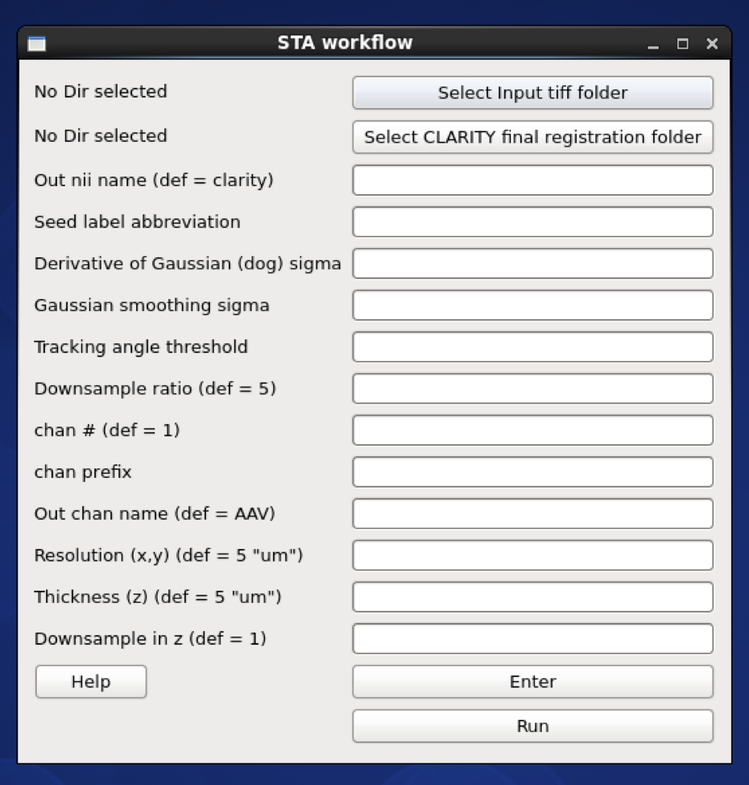

To run structural tensor analysis (STA) workflow for fiber quantification and
tracking

* after running the CLARITY-Allen registration

workflow for STA:

    1) Converts Tiff stack to nii (& down-sample)
    2) Uses registered labels to create a seed mask at the depth
    (ontology level) of the desired label (seed)
    3) Creates a brain mask
	3) Runs STA analysis using the seed and brain masks
	4) Computes virus intensities for all labels at that depth

executes:

    io/miracl_io_convertTifftoNII.py
    lbls/miracl_lbls_get_graph_info.py
    lbls/miracl_lbls_generate_parents_at_depth.py
    utils/miracl_extract_lbl.py
    utils/miracl_create_brainmask.py
    sta/miracl_sta_track_primary_eigen.py
    lbls/miracl_lbls_stats.py

# GUI

from the main GUI OR run:

    miracl_workflow_sta.sh

the following window will appear:

choose input tiff folder with virus channel:

then choose the registered Allen labels inside the final registration folder (reg_final):

choose the output file name

* Output nii name, for example: Mouse05

   (script will append downsample ratio & channel info to given name)

then the tracking parameters:

    - Seed label abbreviation (from Allen atlas ontology) for the seed region:

        for example: **CP** for _Caudoputamen_ or **PL** for _Prelimbic Area_ for combined hemispheres

        **RCP** for _Right Caudoputamen_ for the right hemisphere

    - Labels hemisphere (combined -> both or split -> for left or right label)

    - Derivative of Gaussion (dog) sigma, for example: **1**

    - Gaussian smoothing sigma, for example: **0.5**

    - Tracking angle threshold, for example: **35**

and the tiff conversion parameters:

    - Down-sample ratio (default: 5)
    - Chan # for extracting single channel from multiple channel data (default: 1)
    - Chan prefix (string before channel number in file name). ex: C00
    - Original resolution in x-y plane in um (default: 5)
    - Original thickness (z-axis resolution / spacing between slices) in um (default: 5)
    - Down-sample in z dimension, binary argument, (default: 1) => yes

after choosing the parameters press **Enter** to save them then **Run**

----

# Command-line

usage:

    miracl_workflow_sta.sh -f [Tiff folder] -o [output nifti] -m [ hemisphere ] -l [Allen seed label] -r [Reg final dir] -d [ downsample ratio ]

example:

    miracl_workflow_sta.sh -f my_tifs -o clarity_virus_05xdown.nii.gz -m combined -l PL -r clar_reg_final -n "-d 5 -ch AAV" -t "-g 0.5 -k 0.5 -a 25"

arguments (required):

    f. Input Clarity tif folder/dir [folder name without spaces]

    o. Output nifti

    l. Seed label abbreviation (from Allen atlas ontology)

    m. Labels hemi

    r. CLARITY final registration folder

optional arguments (do not forget the quotes):

    d. Downsample ratio (default: 5)

    conversion (invoked by -n " "):

        cn. [ chan # for extracting single channel from multiple channel data (default: 1) ]
        cp. [ chan prefix (string before channel number in file name). ex: C00 ]
        ch. [ output chan name (default: AAV) ]
        vx. [ original resolution in x-y plane in um (default: 5) ]
        vz. [ original thickness (z-axis resolution / spacing between slices) in um (default: 5) ]
         c. [ nii center (default: 5.7 -6.6 -4) corresponding to Allen atlas nii template ]

    sta parameters (invoked by -t " "):

        g. [ Derivative of Gaussion (dog) sigma ]
        k. [ Gaussian smoothing sigma ]
        a. [ Tracking angle threshold ]
