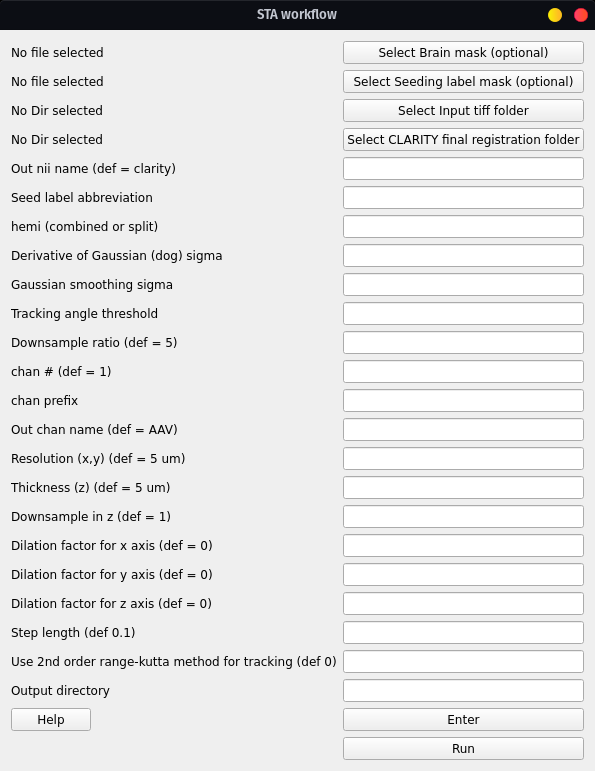

# Running the STA workflow

To run the structural tensor analysis (STA) workflow for fiber quantification 
and tracking

> Run workflow **after** running the CLARITY-Allen registration first

Workflow for STA:

1) Converts Tiff stack to nii incl. down-sampling
2) Uses registered labels to create a seed mask at the depth (ontology level) of the desired label (seed)
3) Creates a brain mask
3) Runs STA analysis using the seed and brain masks
4) Computes virus intensities for all labels at that depth

Executes:

```
conv/miracl_conv_convertTIFFtoNII.py
lbls/miracl_lbls_get_graph_info.py
lbls/miracl_lbls_generate_parents_at_depth.py
utils/miracl_extract_lbl.py
utils/miracl_create_brainmask.py
sta/miracl_sta_track_primary_eigen.py
lbls/miracl_lbls_stats.py
```

## GUI

From the main GUI (`miraclGUI`), select `Workflows -> CLARITY STA`:


Or run:

```
$ miracl flow sta
```

The following window will appear:




Choose input tiff folder with virus channel:

Next choose the registered Allen labels inside the final registration folder (reg_final):


Choose the output file name

* Output nii name, for example: Mouse05

   (script will append downsample ratio & channel info to given name)

the tracking parameters:

```
- Seed label abbreviation (from Allen atlas ontology) for the seed region:

    for example: **CP** for _Caudoputamen_ or **PL** for _Prelimbic Area_ for combined hemispheres

    **RCP** for _Right Caudoputamen_ for the right hemisphere

- Labels hemisphere (combined -> both or split -> for left or right label)

- Derivative of Gaussion (dog) sigma, for example: **1**

- Gaussian smoothing sigma, for example: **0.5**

- Tracking angle threshold, for example: **35**

- Whether or not to use 2nd order runge-kutta method for tracking
```

and the tiff conversion parameters:

    - Down-sample ratio (default: 5)
    - Chan # for extracting single channel from multiple channel data (default: 1)
    - Chan prefix (string before channel number in file name). ex: C00
    - Original resolution in x-y plane in um (default: 5)
    - Original thickness (z-axis resolution / spacing between slices) in um (default: 5)
    - Down-sample in z dimension, binary argument, (default: 1) => yes

Users can also input their own brain mask, as well as their own seeding mask. Both masks would respectively replace the automatically generated brain mask and regional mask used for the tractography. Users also have the option to dilate the seed mask across any of the three dimensions, by a value (indicated by the "Dilation factor" fields)

After choosing the parameters, press **Enter** to save them, and then press **Run**.

----

# Command-line

Usage:

    miracl flow sta -f [Tiff folder] -o [output nifti] -l [Allen seed label] -m [ hemisphere ] -r [Reg final dir] -d [ downsample ratio ]

Example:

    miracl flow sta -f my_tifs -o clarity_virus -l PL -m combined -r clar_reg_final -d 5 -c AAV g 0.5 -k 0.5 -a 25

Or for right PL:

    miracl flow sta -f my_tifs -o clarity_virus -l RPL -m split -r clar_reg_final -d 5 -c AAV -g 0.5 -k 0.5 -a 25

Required arguments:

    -f: Input Clarity tif folder/dir (folder name without spaces)
    -o: Output nifti
    -l: Seed label a bbreviation (from Allen atlas ontology
    -r: CLARITY fina l registration folde
    -m: Labels hemi
    -g: Derivative of Gaussian (dog) sigma
    -k: Gaussian smoothing sigma
    -a: Tracking angle threshold

Optional arguments:

    -d: Downsample ratio (default: 5)
    -c: Output channel name
    -n: Chan # for extracting single channel from multiple channel data (default: 0)
    -p: Chan prefix (string before channel number in file name). ex: C00
    -x: Original resolution in x-y plane in um (default: 5)
    -z: Original thickness (z-axis resolution / spacing between slices) in um (default: 5)
    -b: Brain mask (to replace brain mask automatically generated by workflow)
    -u: Seed mask (in place of regional seed mask generated by workflow)
    -s: Step length
    --downz: Downsample in z
    --dilationfx: Dilation factor for x (factor to dilate seed label by)
    --dilationfy: Dilation factor for y (factor to dilate seed label by)
    --dilationfz: Dilation factor for z (factor to dilate seed label by)
    --rk: Use 2nd order range-kutta method for tracking (default: 0)
    --out_dir: Output directory

## Main Outputs:

| File | Description |
| ---  | ---         |
| `clarity_sta_{label}_seed/dog{dog}_gauss{gauss}/filter_ang{angle}.trk` | Tract file |
| `virus_signal_stats_depth_{depth}.csv` | Virus stats csv |
| `sta_streamlines_density_stats_depth_{depth}.csv` | Streamline density stats csv |

