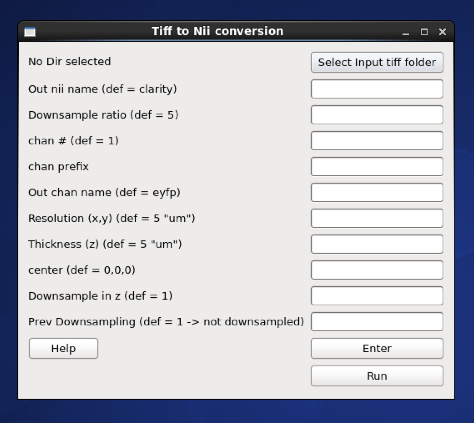

To convert Tiff images to Nifti format for analysis or visualization

# GUI

run:

    miracl_io_convertTIFFtoNII.py

the following window will appear:

choose input tiff folder:

then choose the desired parameters, if default value is ok you can leave it blank

* if the tiff files have more than one channel, for example with the name:

    10-04-06_R923_06R1ca_647_100p350_na144_UltraII_**C001**_xyz-Table Z1284.ome.tif for channel 1 and

    10-04-06_R923_06R1ca_647_100p350_na144_UltraII_**C002**_xyz-Table Z1284.ome.tif for channel 2

    and channel 2 is the desired channel for conversion,

    then **chan #** would be _2_

    and **chan prefix** would be _C00_

and the tiff converstion parameters:

    - Down-sample ratio (default: 5)
    - Original resolution in x-y plane in um (default: 5)
    - Original thickness (z-axis resolution / spacing between slices) in um (default: 5)
    - Down-sample in z dimension, binary argument, (default: 1) => yes

after choosing the parameters press **Enter** to save them then **Run**

After conversion is done, nifti (nii/nii.gz) files can be visualized in ITKsnap

----

# Command-line

usage:

    miracl_io_convertTIFFtoNII.py -f [Tiff folder]

example:

    miracl_io_convertTIFFtoNII.py -f my_tifs -o stroke2 -cn 1 -cp C00 -ch Thy1YFP -vx 2.5 -vz 5

required arguments:

      -f dir, --folder dir  Input CLARITY TIFF folder/dir

optional arguments:

      -d , --down           Down-sample ratio (default: 5)
      -cn , --channum       Chan # for extracting single channel from multiple channel data (default: 1)
      -cp , --chanprefix    Chan prefix (string before channel number in file name). ex: C00
      -ch , --channame      Output chan name (default: eyfp)
      -o , --outnii         Output nii name (script will append downsample ratio & channel info to given name)
      -vx , --resx          Original resolution in x-y plane in um (default: 5)
      -vz , --resz          Original thickness (z-axis resolution / spacing between slices) in um (default: 5)
      -c  [ ...], --center  [ ...]
                            Nii center (default: 0,0,0 ) corresponding to Allen atlas nii template
      -dz , --downzdim      Down-sample in z dimension, binary argument, (default: 1) => yes
      -pd , --prevdown      Previous down-sample ratio, if already downs-sampled
      -h, --help            Show this help message and exit