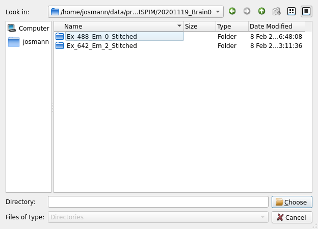
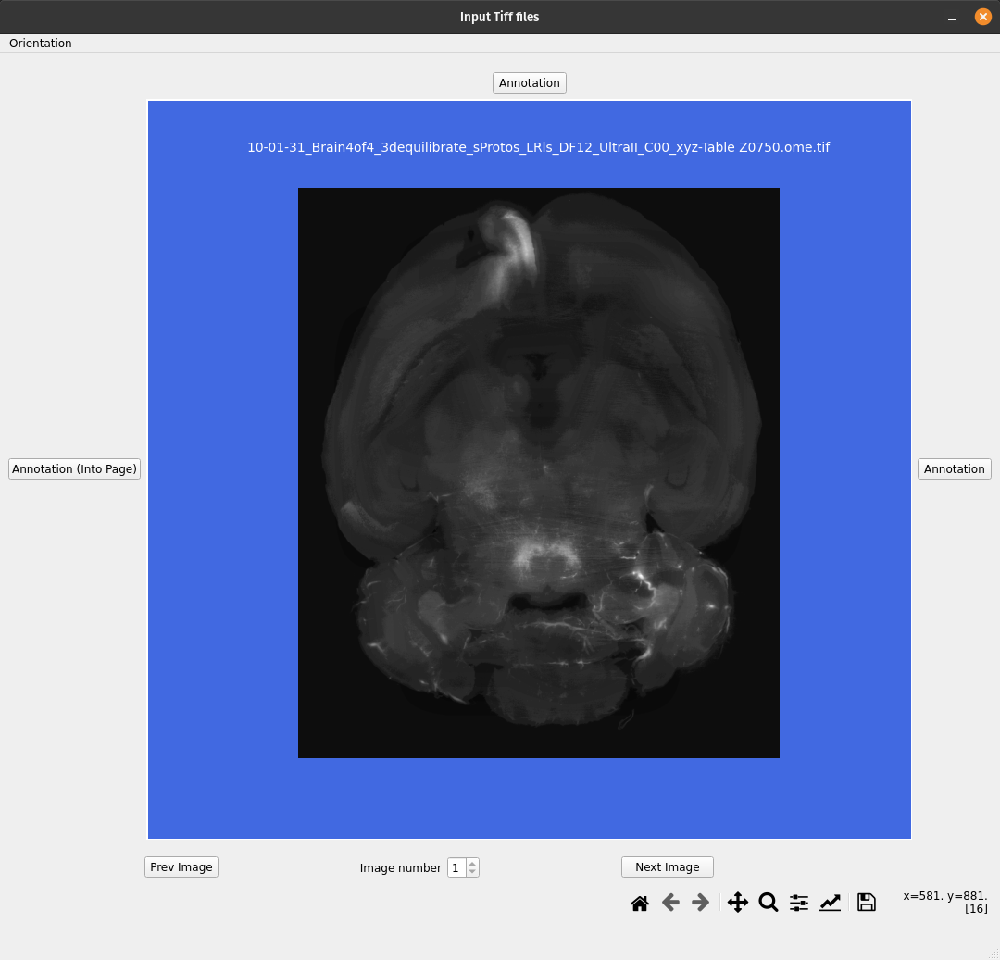
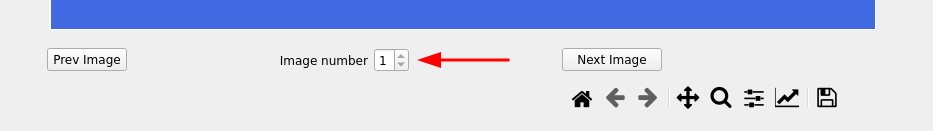
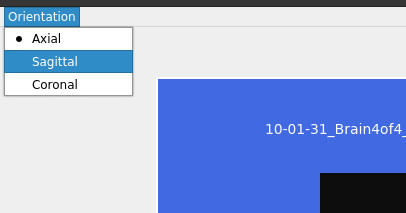
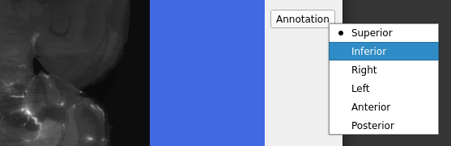
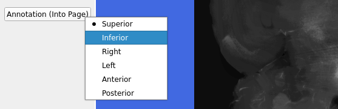
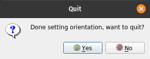
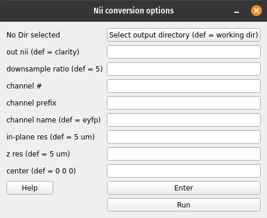
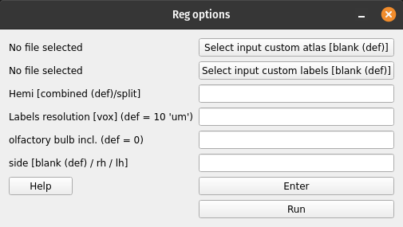

CLARITY whole-brain registration to Allen Atlas
###############################################

The registration workflow relies on an autofluorescence channel input 
(tiff files), and can perform whole-brain or hemisphere registrations to the 
Allen Atlas.

This workflow performs the following tasks:

#. Sets orientation of input data using a GUI
#. Converts TIFF to NII
#. Registers CLARITY data (down-sampled images) to Allen Reference mouse brain 
   Atlas
#. Warps Allen annotations to the original high-res CLARITY space
#. Warps the higher-resolution CLARITY to Allen space (if chosen)
#. Test data
#. A test dataset (CLARITY autofluorescence channel) for registration is found 
   here under data: 
   https://www.dropbox.com/sh/i9swdedx7bsz1s8/AABpDmmN1uqPz6qpBLYLtt8va

Main outputs
============

.. table::

   ===============================================================================  =============================================================
   File	                                                                            Description
   ===============================================================================  =============================================================
   :file:`reg_final/clar_allen_space.nii.gz`	                                      CLARITY data in Allen reference space
   :file:`reg_final/clar_downsample_res\\{vox\\}um.nii.gz`	                        CLARITY data downsampled and oriented to 'standard'
   :file:`reg_final/annotation_hemi_\\{hemi\\}_\\{vox\\}um_clar_downsample.nii.gz`  Allen labels registered to downsampled CLARITY
   :file:`reg_final/annotation_hemi_\\{hemi\\}_\\{vox\\}um_clar_vox.tif`	          Allen labels registered to oriented CLARITY
   :file:`reg_final/annotation_hemi_\\{hemi\\}_\\{vox\\}um_clar.tif`	              Allen labels registered to original (full-resolution) CLARITY
   ===============================================================================  =============================================================

GUI
===

Run:

.. code-block::

   $ miraclGUI

and choose CLARITY-Allen Registration from the Workflows tab:

.. image:: ../../../images/MIRACL_main-menu.png

Or run:

.. code-block::

   $ miracl flow reg_clar

Choose the input tiff folder with the auto fluorescence channel from the pop-up menu:

The following GUI will appear which opens the data and lets you set its orientation manually:

You can navigate through the data using the bar bellow, by specifying the slice number or using the arrows:

First choose the data plane (axial, coronal or sagittal):

Then choose the orientation at the top and right of the image:

Next, choose the orientation for scrolling through the slices (going into the page), can confirm the orientation by changing the image number at the bottom (enter higher number and press ``Enter``), or using the ``Next`` or ``Prev`` image buttons:

Finally close the GUI:

Next, set the tiff conversion parameters:

Conversion parameters description:

.. table::

   ================  ===============================================================================================================================================================================================================================================  ==========================================
   Parameter	       Description	                                                                                                                                         Default
   ================  ===============================================================================================================================================================================================================================================  ==========================================
   out nii	         Output nifti name	                                                                                                                                                                                                                              ``clarity``
   downsample ratio	 Downsample factor for conversion	                                                                                                                                                                                                                ``5``
   channel #	       Number for extracting single channel from multiple channel data (leave blank if single channel data/tiff files)	                                                                                                                                ``0``
   channel prefix	                                                                                                                                                                                                                                                    Channel prefix not invoked if not provided

                     String before channel number in file name (leave blank if single channel). For example, if tiff file name has :file:`_C001_.tif` for channel 1 and :file:`_C002_.tif` for channel 2, to choose channel 1 if it's the auto fluorescence channel:
   
                     * Chan number would be: ``1``
                     * Chan prefix would be: ``C00``
   channel name	     Output channel name	                                                                                                                                                                                                                            ``eyfp``
   in-plane res	     Original resolution in x-y plane in um	                                                                                                                                                                                                          ``5``
   z res	           Thickness (z-axis resolution/spacing between slices) in um	                                                                                                                                                                                      ``5``
   center	           Center of nifti file	                                                                                                                                                                                                                            ``0 0 0``
   ================  ===============================================================================================================================================================================================================================================  ==========================================

Next, choose the registration options:

Registration parameters description:

.. table::

   =======================  ==========================================================================================================================================================================  ============
   Parameter	              Description	                                                                                                                                                                Default
   =======================  ==========================================================================================================================================================================  ============
   Hemi	                    Warp Allen labels with hemisphere split (Left labels are different from Right labels) or combined (Left and Right lables are the same i.e. mirrored). Accepted inputs are:  ``combined``

                            * ``combined``
                            * ``split``
   Labels resolution [vox]	Voxel size/resolution of labels in um accepted inputs are: ``10``, ``25`` or ``50``	                                                                                        ``10``
   olfactory bulb	          If olfactory bulb is included in the dataset. Accepted inputs are:                                                                                                          ``0``

                            ``0`` (not included)
                            ``1`` (included)
   Side	                    **Only if registering hemisphere, else leave blank.** Accepted inputs are:                                                                                                  ``None``

                            ``rh`` (right hemisphere)
                            ``lh`` (left hemisphere)
   =======================  ==========================================================================================================================================================================  ============

Command-line
============

Usage:

.. code-block::

   $ miracl flow reg_clar -f [ Tiff folder ]

Example:

.. code-block::

   $ miracl flow reg_clar  -f my_tifs -n "-d 5 -ch autofluo" -r "-o ARS -m combined -v 25"

Arguments (required):

.. code-block::

   f. Input Clarity tif dir/folder

Optional arguments (remember the quotes):

.. code-block::

   Conversion to nii (invoked by -n " "):
   
   d.  [ Downsample ratio (default: 5) ]
   cn. [ chan # for extracting single channel from multiple channel data (default: 0) ]
   cp. [ chan prefix (string before channel number in file name). ex: C00 ]
   ch. [ output chan name (default: eyfp) ]
   vx. [ original resolution in x-y plane in um (default: 5) ]
   vz. [ original thickness (z-axis resolution / spacing between slices) in um (default: 5) ]
   c.  [ nii center (default: 5.7 -6.6 -4) corresponding to Allen atlas nii template ]

   Registration (invoked by -r " "):
   
   o. Orient code (default: ALS)
      to orient nifti from original orientation to "standard/Allen" orientation
   m. Warp allen labels with hemisphere split (Left different than Right labels) or combined (L & R same labels / Mirrored)
      accepted inputs are: <split> or <combined>  (default: combined)
   v. Labels voxel size/Resolution of labels in um
      accepted inputs are: 10, 25 or 50  (default: 10)
   l. image of input Allen Labels to warp (default: annotation_hemi_split_10um.nii.gz - which are at a resolution of 0.01mm/10um)
      input could be at a different depth than default labels
      If l. is specified (m & v cannot be specified)

Visualize results
=================

Run:

.. code-block::

   $ miracl reg check

Usage:

.. code-block::

   $ miracl reg check -f [ reg_final_folde r] -v [ visualization_software ] -s [ reg_space_(clarity_or_allen) ]

Example:

.. code-block::

   $ miracl reg check -f reg_final -v itk -s clarity

Arguments:

.. code-block::

   Required:

     -f, Input final registration folder

   Optional:

     -v, Visualization software: itkSNAP 'itk' (default) or freeview 'free'
     -s, Registration Space of results: clarity (default) or allen
