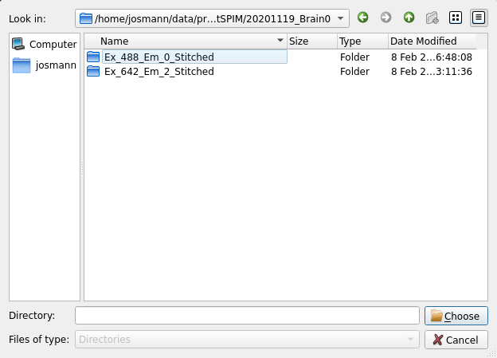

CLARITY whole-brain segmentation
################################

There are multiple segmentation functions for different data (stains/channels):

* ``virus``
* ``cFos``
* ``sparse``
* ``nuclear``

The segmentation workflow relies on an output from the registration workflow, 
but the segmentation wrapper function can be run without running the 
registration workflow.

This workflow performs the following tasks:

#. Segments neurons in cleared mouse brain of sparse or nuclear stains in 3D
#. Voxelizes segmentation results into density maps with Allen Atlas resolution
#. Computes features of segmented image and summarizes them per label

It executes:

.. code-block::

   seg/miracl_seg_clarity_neurons_wrapper.sh
   seg/miracl_seg_voxelize_parallel.py
   seg/miracl_seg_feat_extract.py

Main outputs
============

.. table::

   ===================================================================================  ================================================
   File	                                                                                Description
   ===================================================================================  ================================================
   :file:`segmentation/seg.\\{tif,mhd\\}`	or :file:`seg_nuclear.\\{tif,mhd\\}`          Segmentation image with all labels (cells)
   :file:`segmentation/seg_bin.\\{tif,mhd\\}` or :file:`seg_bin_nuclear.\\{tif,mhd\\}`  Binarized segmentation image
   :file:`voxelized_seg.\\{tif,nii\\}`	                                                Segmentation results voxelized to ARA resolution
   :file:`voxelized_seg_bin.\\{tif,nii\\}`	                                            Binarized version
   :file:`clarity_segmentation_features_ara_labels.csv`	                                Segmentation features summarized per ARA labels
   ===================================================================================  ================================================

.. hint::
   Results can be opened in Fiji for visualization

GUI
===

Select from the main GUI menu (invoked from the cli: ``$ miraclGUI``) or run:

.. code-block::

   $ miracl flow seg

The following window will appear:

Click on ``Select registered labels (..clar_vox.tif) in the reg_final dir`` 
to choose the registered labels 
:file:`annotation_hemi_\\{side\\}_**um_clar_vox.tif` to summarize segmentation 
features where:

* ``{side}`` -> ``combined`` or ``split``
* ``**`` is the resolution -> ``10``, ``25`` or ``50``

The following window will appear:

Next, click on ``select input tiff dir`` to select folder with :file:`Thy1-YFP` 
or other channel:

Lastly set the segmentation parameters:

.. table::

   =================  ===========================================================================  =========
   Parameter	        Description	                                                                 Default
   =================  ===========================================================================  =========
   seg type	                                                                                       ``virus``
                      
                      Channel type:

                      * ``virus``
                      * ``cFos``
                      * ``sparse`` (like ``Thy1 YFP``)
                      * ``nuclear`` (like ``PI``)
   channel prefix     Channel prefix and number if multiple channels. Example: :file:`Filter0001`  ``None``
   labels voxel size                                                                               ``10``

                      Registered labels voxel size in um: 

                      * ``10``
                      * ``25``
                      * ``50``
   =================  ===========================================================================  =========

Click ``Enter`` and ``Run`` to start the segmentation process.

Command-line
============

Usage:

.. code-block::

   $ miracl flow seg -f [ Tiff_folder ]

Example:

.. code-block::

   $ miracl flow seg -f my_tifs -t nuclear -s "-p C001" -e "-l reg_final/annotation_hemi_combined_25um_clar_vox.tif"

Arguments:

.. code-block::

   arguments (required):

     f. Input Clarity tif folder/dir [folder name without spaces]
     t. Channel type: sparse (like Thy1 YFP) or nuclear (like PI)

   optional arguments (don't forget the quotes):

     Segmentation (invoked by -s " "):
       p. Channel prefix & number if multiple channels (like Filter0001)

     Feature extraction (invoked by -e " "):
       l. Allen labels (registered to clarity) used to summarize features
          reg_final/annotation_hemi_{hemi}_{vox}um_clar_vox.tif
