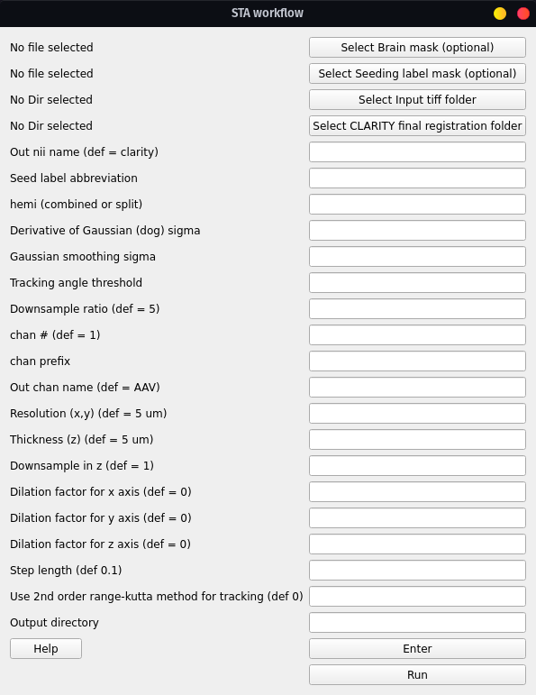

STA workflow
############

Run the structural tensor analysis (STA) workflow for fiber quantification 
and tracking.

.. attention::
   Run workflow after running the CLARITY-Allen registration first

Workflow for STA:

#. Converts Tiff stack to nii incl. down-sampling
#. Uses registered labels to create a seed mask at the depth (ontology level) of the desired label (seed)
#. Creates a brain mask
#. Runs STA analysis using the seed and brain masks
#. Computes virus intensities for all labels at that depth

Executes:

.. code-block::

   conv/miracl_conv_convertTIFFtoNII.py
   lbls/miracl_lbls_get_graph_info.py
   lbls/miracl_lbls_generate_parents_at_depth.py
   utils/miracl_extract_lbl.py
   utils/miracl_create_brainmask.py
   sta/miracl_sta_track_primary_eigen.py
   lbls/miracl_lbls_stats.py

Main Outputs
============

.. table::

   ========================================================================================  ========================
   File	                                                                                     Description
   ========================================================================================  ========================
   ``clarity_sta_{label}_seed/dog{dog}_gauss{gauss}/filter_ang{angle}.trk``	                 Tract file
   ``virus_signal_stats_depth_{depth}.csv``	                                                 Virus stats csv
   ``sta_streamlines_density_stats_depth_{depth}.csv``	                                     Streamline density stats csv
   ========================================================================================  ========================

GUI
===

From the main GUI (invoked with: ``$ miraclGUI``), select ``Workflows -> 
CLARITY STA``:

.. image:: ../../../images/MIRACL_main-menu.png

The following window will appear:

.. hint::
   To open the STA workflow menu directly use: ``$ miracl flow sta``

Click on ``Select Input tiff folder`` and choose the folder that contains the 
virus channel from the dialog window.

Then choose the registered Allen labels inside the final registration folder 
(``reg_final``) from the dialog window by clicking on ``Select CLARITY final 
registration folder``.

Next choose the output file name (``Output nii name``), e.g. ``Mouse05``. Our 
script will automatically append downsample ratio and channel info to the given 
name.

Set the tracking parameters:

.. table::

   =============================================  =========================================================  ==========================================================
   Parameter	                                    Description	                                               Default
   =============================================  =========================================================  ==========================================================
   Seed label abbreviation	                                                                                 Required. Function will exit with error 1 if not provided.

                                                  From Allen atlas ontology, for the seed region. Examples:
   
                                                  Combined hemispheres:

                                                  * ``CP`` for Caudoputamen
                                                  * ``PL`` for Prelimbic Area

                                                  Right hemisphere:
   
                                                  * ``RCP`` for Right Caudoputamen
                                                  * ``RPL`` for Right Prelimbic Area
   hemi	                                                                                                     ``combined``

                                                  Labels hemisphere. Accepted inputs are:

                                                  * `combined`` (both)
                                                  * ``split`` (left or right)
   Derivative of Gaussian (dog) sigma	            Example: ``1``	                                           ``0.5,1.5``
   Gaussian smoothing sigma	                      Example: ``0.5``	                                         ``0.5,2``
   Tracking angle threshold	                      Example: ``35``	                                           ``25,35``
   Use 2nd order runge-kutta method for tracking	                                                           ``0``

                                                  Use 2nd order runge-kutta:
                                                  
                                                  * ``0`` (don't use)
                                                  * ``1`` (use)
   =============================================  =========================================================  ==========================================================

And the tiff conversion parameters:

.. table::

   ================  ====================================================================  =======
   Parameter	       Description	                                                         Default
   ================  ====================================================================  =======
   Downsample ratio  Set the downsample ratio.	                                           ``5``
   chan #	           For extracting single channel from multiple channel data.	           ``1``
   chan prefix	     String before channel number in file name. Example:                   ``C00``
   Resolution (x,y)  Original resolution in x-y plane in um.	                             ``5``
   Thickness         Original thickness (z-axis resolution/spacing between slices) in um.  ``5``
   Downsample in z                                                                         ``1``

                     Downsample in z dimension. Binary:

                     * ``0`` (no)
                     * ``1`` (yes)
   ================  ====================================================================  =======

Users can also input their own brain mask, as well as their own seeding mask. 
Both masks would respectively replace the automatically generated brain mask 
and regional mask used for the tractography. Users also have the option to 
dilate the seed mask across any of the three dimensions, by a value (indicated 
by the ``Dilation factor`` fields).

.. attention::
   Note that the following parameters are required:

   * ``tiff folder``
   * ``output nii name``
   * ``Seed label abbreviation``
   * ``CLARITY final registration folder``
   * ``hemi``
   * ``Derivative of Gaussian``
   * ``Gaussian smoothing sigma``
   * ``Tracking angle threshold``

After choosing the parameters, first press ``Enter`` to save them and then 
``Run`` to start the workflow.

Command-line
============

Usage:

.. code-block::

   $ miracl flow sta -f [ Tiff folder ] -o [ output nifti ] -l [ Allen seed label ] -m [ hemisphere ] -r [Reg final dir] -d [ downsample ratio ]

Example:

.. code-block::

   $ miracl flow sta -f my_tifs -o clarity_virus -l PL -m combined -r clar_reg_final -d 5 -c AAV g 0.5 -k 0.5 -a 25

Or for right PL:

.. code-block::

   $ miracl flow sta -f my_tifs -o clarity_virus -l RPL -m split -r clar_reg_final -d 5 -c AAV -g 0.5 -k 0.5 -a 25

Arguments:

.. code-block::

   arguments (required):
     -f: Input Clarity tif folder/dir (folder name without spaces)
     -o: Output nifti
     -l: Seed label abbreviation (from Allen atlas ontology)
     -r: CLARITY final registration folder
     -m: Labels hemi
     -g: Derivative of Gaussian (dog) sigma
     -k: Gaussian smoothing sigma
     -a: Tracking angle threshold

   optional arguments:
     -d: Downsample ratio (default: 5)
     -c: Output channel name
     -n: Chan number for extracting single channel from multiple channel data (default: 0)
     -p: Chan prefix (string before channel number in file name). ex: C00
     -x: Original resolution in x-y plane in um (default: 5)
     -z: Original thickness (z-axis resolution/spacing between slices) in um (default: 5)
     -b: Brain mask (to replace brain mask automatically generated by workflow)
     -u: Seed mask (in place of regional seed mask generated by workflow)
     -s: Step length
     --downz: Downsample in z
     --dilationfx: Dilation factor for x (factor to dilate seed label by)
     --dilationfy: Dilation factor for y (factor to dilate seed label by)
     --dilationfz: Dilation factor for z (factor to dilate seed label by)
     --rk: Use 2nd order range-kutta method for tracking (default: 0)
     --out_dir: Output directory
